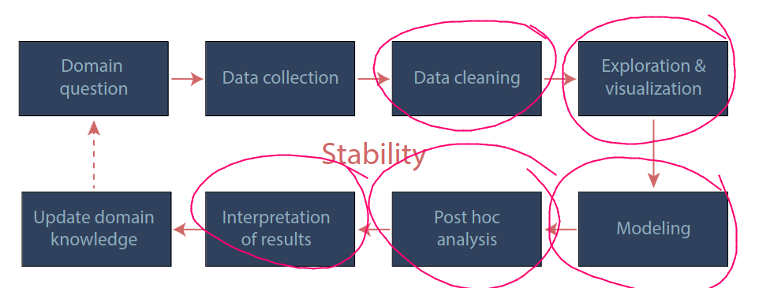
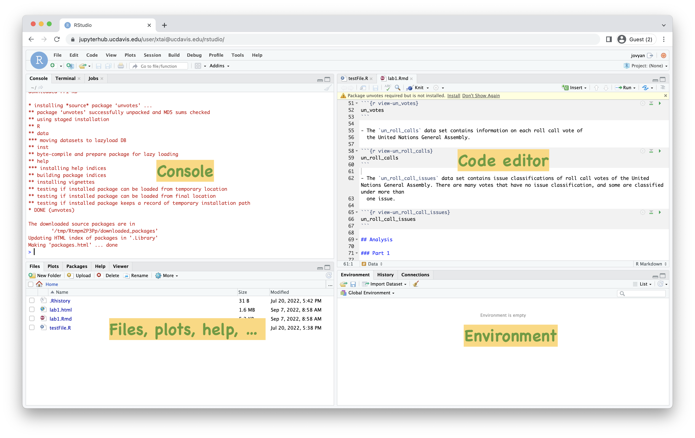
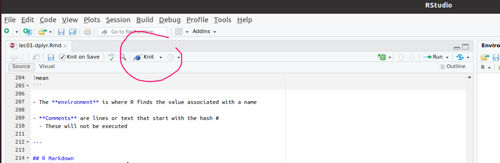

```{r packages, echo=FALSE, message=FALSE, warning=FALSE}
library(dplyr)
library(ggplot2)
library(unvotes)
```


## Agenda
- Course overview 

- Course logistics

- Fundamentals of R

---

## Data science life cycle


```{r echo=FALSE, out.width="90%", fig.align="center"}

```
Yu and Kumbier, PNAS'19

---

## Course content 

1. **Advanced R**  
  - Tidy data
  - Transforming vectors, numbers, strings, factors, dates, times
  - ggplot visualizations
  - Functions

2. **Correlation, regression, and inference**
  - Linear regression
  - Analysis of variance
  - Permutation tests

Prerequisite(s): one of the following two options:

  - STA 013 (C- or better) or STA 013Y (C- or better) or ECS 032A (C- or better)
 - STA 035A (C- or better) or STA 032 (C- or better) or STA 100 (C- or better)

Corequisite (i.e., can be concurrent):

   - MAT 016B or MAT 017B or MAT 021B.

These requirements are strict.

---

## Course logistics 
- **Lectures** Monday, Wednesday and Friday

- Tuesday **lab** (run by Mengjie Shie)

- **Office hours**
  - Mengjie Shie: TBD
  - Spencer Frei: Wednesdays, 3pm-4pm MSB 4220

- **Course website**: http://spencerfrei.github.io/teaching/sta35b/index.html 
  - Lecture notes, homework, supplementary materials, etc.
  
- **Canvas** for lab materials, turning in labs and homework (through Gradescope), solutions and grade-book

- **Piazza** for announcements and discussion

- **Email** for personal matters only (**do not** send me messages on Canvas)

---

## Course logistics 

- **Waitlist**:

  - If you are no longer interested in taking the course, please drop sooner rather than later; there are many students on the waitlist
  - I have no control of the waitlist 

---

## Grading  

- 15% labs
  - Due at 9pm, Monday after lab
  
- 25% homework (roughly weekly)
  - Assigned on Friday afternoon, due Thursday 9pm
  
- 30% midterms (two midterms, one dropped)

- 30% final

- See syllabus on course webpage for full details

---
## Software
- R is a free, open-source **statistical programming language** for statistical computing

- It is also an **interactive environment** for doing data science

- Data science teams often use a **mix of languages**, including R, Python, Julia, ... 


- R **Console**: Basic interaction with R is by typing in the console, a.k.a. terminal or command-line

- You type in commands, R gives back answers (or errors)

- It is easily **extensible** with packages

- **Menus and other graphical interfaces** are extras built on top of the console

---

## Quick R demonstration
- Arithmetic 
```{r comment=NA}
1 + 2
```

- Comparisons
```{r comment=NA}
1 == 2
```


---

## Computing set up

- UC Davis **JupyterHub** (https://jupyterhub.ucdavis.edu/) has RStudio set up 

- Alternatively, you can install R and RStudio on **your own computers** 

- You will need **regular, reliable access to a computer** either with a working browser, or running an up-to-date version of R and RStudio

- If this is a problem, please let us know right away. There are resources available to support you.

- Labs will be at TLC 2212; either use computers available in the lab, or your own laptops (make sure your laptop is charged before class)


---

## JupyterHub
After going to Jupyter hub and clicking on RStudio, it will bring you to this page:
```{r echo=FALSE, out.width="70%"}

```
To upload `Rmd` files or data files, download them to your computer (from the course webpage or from Canvas), and then upload them to the server using the Upload button in the Files pane. 

---

## A short list of R essentials

- **Functions** are (most often) verbs, followed by what they will be applied to in parentheses:

```{r eval=FALSE}
do_this(to_this)
do_that(to_this, to_that, with_those)
```

- **Packages** are extensions to R
  - They include functions, documentation, and sample data
  - They are hosted on **CRAN** (the Comprehensive R Archive Network)
  - They are installed using `install.packages()` and loaded using `library()`, once per session:

```{r eval=FALSE}
install.packages("package_name")
library(package_name)
```

Alternatively, you can call a function from a package without loading it, using `package_name::do_this()`.

---
## A short list of R essentials
- Object **documentation** can be accessed with `?` or `help()`

```{r eval=FALSE}
?mean
```

- The **environment** is where R finds the value associated with a name

- **Comments** are lines or text that start with the hash #
  - These will not be executed 

---

## R Markdown
```{r echo=FALSE, out.width="80%", fig.align="center"}

```

- R Markdown is a tool to **integrate code and written prose** in reproducible computational documents

- R Markdown files have the `Rmd` extension. Each time you "knit," the analysis is run from the beginning.

- To learn more, go to [rmarkdown.rstudio.com](https://rmarkdown.rstudio.com/)

- Labs will be completed in R Markdown

- Code goes in **chunks**, defined by three backticks, narrative goes outside of chunks

- Homework: if not familiar with Rmd, go through tutorial: https://rmarkdown.rstudio.com/lesson-1.html


---


## Basic data types in R

.pull-left[
Basic data types:
* Numeric (`235.22`)
* Integer (`1`)
* Character / string (`"I love programming"`)
* Logical / boolean (`TRUE`, `FALSE`)
* Missing (`NA`)

You assign values to variables using the `<-` operator.

If you place parenthesis around it, it is equivalent to printing out after. 
```{r}
x <- 10.5
x
(x <- 11.5)
```
]
--

.pull-right[
```{r, echo = TRUE}
x <- 10.5
class(x)

x <- 1000L # R declares integers by putting L after numbers
class(x)

x <- "I love programming"
class(x)

x <- TRUE
class(x) 
```
]

---


## Operations on data types in R

.pull-left[
You can inspect data by entering the variable name into the console, or by using `str`
```{r}
x <- 10.5
x
str(x)
```
]

--
.pull-right[

You can Combine values into a vector or list using `c()`.
This will sometimes coerce different data types into the same type. 
```{r, echo = TRUE}
x <- c(3, 2)
str(x)

x <- c(3, "haha")
str(x)
```
]

---
## Combining values into vectors/lists
In addition to `c()`, helpful to use `rep(thing_to_repeat, num_repetitions)`:

```{r, echo=TRUE}
( x <- c(0, 1) )
( y <- rep(x, 3) )
```


