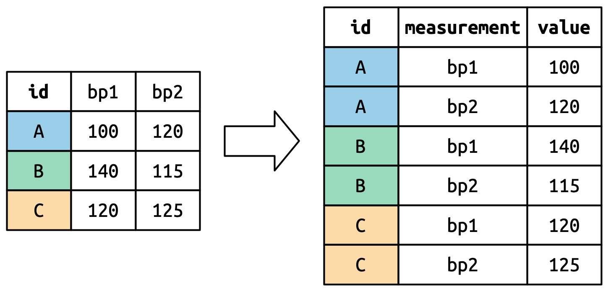

```{r packages, echo=FALSE, message=FALSE, warning=FALSE}
library(ggplot2)
library(tidyverse)
library(unvotes)
library(knitr)

hook_output <- knit_hooks$get("output")
knit_hooks$set(output = function(x, options) {
  lines <- options$output.lines
  if (is.null(lines)) {
    return(hook_output(x, options))  # pass to default hook
  }
  x <- unlist(strsplit(x, "\n"))
  more <- "..."
  if (length(lines)==1) {        # first n lines
    if (length(x) > lines) {
      # truncate the output, but add ....
      x <- c(head(x, lines), more)
    }
  } else {
    x <- c(more, x[lines], more)
  }
  # paste these lines together
  x <- paste(c(x, ""), collapse = "\n")
  hook_output(x, options)
})

knitr::opts_chunk$set(comment = NA) # makes it so the ## doesnt appear in output for chunks
```


## Reminder about packages

Packages are things we load using `library()`.

We'll primarily use the `tidyverse` library, but occasionally we'll use other packages.

If you haven't installed a package `PACKAGENAME` before, you'll get an error.

To install a package, `install.packages(PACKAGENAME)`.

---

## dataframes/tibbles 
The main objects we'll care about in R are dataframes and tibbles - you should be familiar with these. 

 <!-- Tibbles are a special type of data frame that have nicer properties - we'll use these for all of the course. -->


```{r, echo=TRUE, message=FALSE, warning=FALSE}
library(nycflights13) # loads the `flights` tibble into environment
flights
```

---

## dataframes/tibbles
Useful functions for inspecting dataframes: `head()` and `str()`
```{r}
head(flights)
```


---

## dataframes/tibbles
Useful functions for inspecting dataframes: `head()` and `str()`
```{r, output.lines=8}
str(flights)
```

---

## dataframes/tibbles
To return the data from a column in a dataframe/tibble, use `df$COLUMN` (returns vector)
```{r, output.lines=5}
flights$distance
```
`df[,"COLUMN"]` (returns tibble)
```{r, output.lines=5}
flights[,"distance"]
```


---
## Piping: `%>%` and `|>`
The operators `%>%` (and equivalently, `|>`) allow for you to write operations sequentially.
```{r}
mean(flights$distance)
```
Same as:
```{r}
flights$distance %>%
  mean
```
We will see more complex examples of this shortly. 

---
## The `select()` function
Returns a tibble with the columns specified, in order specified. 
Do not need quotation marks.
```{r, output.lines = 6}
(colnames(flights))
after_select <- flights %>%
  select(time_hour, origin, dest, air_time, distance)
(colnames(after_select))
```

Helper functions for `select()`:

*    `starts_with("abc")`: matches names that begin with “abc”.
*    `ends_with("xyz")`: matches names that end with “xyz”.
*    `contains("ijk")`: matches names that contain “ijk”.
*    `num_range("x", 1:3)`: matches x1, x2 and x3.

---

## The `select()` function
```{r}
colnames(flights)
after_select <- flights %>%
  select(time_hour, origin, dest, contains("sched"))
colnames(after_select)
```


---
## The `filter()` function

```{r, eval=FALSE}
# data = data to filter
# expr<#> = expression used to filter data, typically using ==, >, etc
filter(<data>, <expr1>)
filter(<data>, <expr1>, <expr2>, <expr3>)
```

Example: flights on February 15
```{r, echo = TRUE, comment = NA, output.lines=8}
filter(flights, month == 2, day == 15)
```


---
## The `filter()` function 
```{r, eval=FALSE}
# data = data to filter
# expr = expression used to filter data, typically using ==, >, etc
filter(<data>, <expr>)
```

Expressions can be built up using comparison operators and logical operators.
* `&` is "and"
* `|` is "or"
* `!` is "not"
* `%in%` is a membership checker (is an object inside of a vector)
* `>`, `<` mean greater than, less than
* `>=`, `<=` mean greater than or equal to, less than or requal to
* `==` means "is equal"
* `!=` means "is not equal"

---

## Examples of `filter()`
```{r, output.lines=6}
flights %>%
  select(time_hour, origin, dest, air_time, distance) %>%
  filter(distance < 120)
```

```{r, output.lines=5}
flights %>%
  select(time_hour, origin, dest, air_time, distance) %>%
  filter(distance < 120, origin == 'EWR')
```

---
## Spot the error?
```{r, output.lines=6, eval = FALSE}
flights %>%
  select(time_hour, origin, dest, air_time, distance) %>%
  filter(origin == SFO)
```

---

## Spot the error?
```{r, output.lines=6, eval = FALSE}
flights %>%
  select(time_hour, origin, dest, air_time, distance) %>%
  filter(origin == 'SFO')
```

---
## Equivalent ways to filter on multiple conditions
```{r, output.lines=5}
flights %>%
  select(time_hour, origin, dest, air_time, distance) %>%
  filter(distance < 120, origin == "EWR")
```


```{r, output.lines=5, eval = FALSE}
flights %>%
  select(time_hour, origin, dest, air_time, distance) %>%
  filter(distance < 120 & origin == "EWR")
```

```{r, output.lines=5, eval = FALSE}
flights %>%
  select(time_hour, origin, dest, air_time, distance) %>%
  filter(distance < 120) %>%
  filter(origin == "EWR")
```


---

## `mutate()`
The function `mutate()` adds new columns to the data frame using functions of extant columns.

Example:
```{r, output.lines = 7}
small_flights <- flights %>%
  select(origin, dest, air_time, distance, air_time)
small_flights %>%
  mutate(hours = air_time / 60,
         mi_per_hour = distance / hours, 
         km_per_hour = 1.61 * mi_per_hour)
```

Notice how `mi_per_hour` uses `hours`, which was created within the same `mutate()` call. 


---

## Summary statistics and missing data
Common summary statistics of interest in data:
* Mean (`mean()`)
* Min/max (`min()`, `max()`)
* Median (`median()`)
* Standard deviation / variance (`sd()`, `var()`)

R denotes missing data using `NA`.  Typically, if you compute a function of a vector with `NA`s, it will return `NA`, unless you put `na.rm=TRUE`.
```{r}
x <- c(-1, 0, 1, NA)
(mean(x))
(mean(x, na.rm=TRUE))
```

---
## `summarise()`
If you want to compute summary statistics of dataframe, use `summarise()`.

```{r, eval=FALSE}
# data = data you want to create a new variable from
# new var name = the name your new variable will be
# calc exp = the calculation you want to perform
summarise(<data>, <new var name> = <calc exp>)
```

```{r, output.lines=5}
flights %>%
  select(origin, dest, air_time, distance) %>%
  mutate(hours = air_time / 60,
         mi_per_hour = distance / hours) %>%
  summarise(flight_time = mean(mi_per_hour))
```

---
## `summarize()`
If you want to compute summary statistics of dataframe, use `summarise()`.

```{r, eval=FALSE}
# data = data you want to create a new variable from
# new var name = the name your new variable will be
# calc exp = the calculation you want to perform
summarize(<data>, <new var name> = <calc exp>)
```

```{r, output.lines=5}
flights %>%
  select(origin, dest, air_time, distance) %>%
  mutate(hours = air_time / 60,
         mi_per_hour = distance / hours) %>%
  summarize(flight_time = mean(mi_per_hour, na.rm=TRUE))
```


---
## `group_by()` and `summarise()`
If you would like to compute summary statistics per category, use `group_by()` first.
```{r, output.lines=7}
flights %>%
  select(origin, dest, air_time, distance) %>%
  group_by(origin) %>%
  summarize(median_distance = median(distance, na.rm=TRUE),
            max_air_time = max(air_time, na.rm=TRUE))
```

---
## Complex calculations

.delay[ 

Average flight time, in hours, per origin airport for flights > 500 miles long?

]
.delay[

```{r, output.lines=7}
flights %>%
  select(origin, dest, air_time, distance) %>%
  mutate(air_time_hrs = air_time / 60) %>%
  filter(distance > 500) %>%
  group_by(origin) %>%
  summarize(avg_flight_time_hrs = mean(air_time_hrs, na.rm=TRUE))
```

]

---
## Complex calculations
Average flight time, in minutes, per origin airport, when flight is > 500 miles long vs. <= 500 miles long?

We need to `group_by` two variables: origin airport, and whether or not flight is > 500 or <= 500 miles.

We need to create the latter variable.
```{r, output.lines=7, warning=FALSE}
flights %>%
  select(origin, dest, air_time, distance) %>%
  mutate(air_time_hrs = air_time / 60,
         distance_greater_500mi = distance > 500)
```

---
## Complex calculations
Average flight time, in minutes, per origin airport, when flight is > 500 miles long vs. <= 500 miles long?

```{r, output.lines=12, message=FALSE}
flights %>%
  select(origin, dest, air_time, distance) %>%
  mutate(air_time_hrs = air_time / 60,
         distance_greater_500mi = distance > 500) %>%
  group_by(origin, distance_greater_500mi) %>%
  summarize(avg_flight_time_hrs = mean(air_time_hrs, na.rm=TRUE))
```


---

### Tidy data

Multiple equivalent ways of organizing data into a dataframe. 
```{r, eval=FALSE, comment=NA}
table1
#> # A tibble: 6 × 4
#>   country      year  cases population
#>   <chr>       <dbl>  <dbl>      <dbl>
#> 1 Afghanistan  1999    745   19987071
#> 2 Afghanistan  2000   2666   20595360
#> 3 Brazil       1999  37737  172006362
#> 4 Brazil       2000  80488  174504898
#> 5 China        1999 212258 1272915272
#> 6 China        2000 213766 1280428583

table2
#> # A tibble: 12 × 4
#>   country      year type           count
#>   <chr>       <dbl> <chr>          <dbl>
#> 1 Afghanistan  1999 cases            745
#> 2 Afghanistan  1999 population  19987071
#> 3 Afghanistan  2000 cases           2666
#> 4 Afghanistan  2000 population  20595360
#> 5 Brazil       1999 cases          37737
#> 6 Brazil       1999 population 172006362
#> # ℹ 6 more rows

```
table1 is **tidy** - easier to work with using `tidyverse`. 

---
### Tidy data

*    Each variable is a column; each column is a variable.
*    Each observation is a row; each row is an observation.
*    Each value is a cell; each cell is a single value.


Why tidy data?  
* Consistency - uniform format makes collaboration easier
* Vectorization - R commands often operate on vectors of data, best for each column to be a vector of data


---
### **Tidying** data

Unfortunately, most real-world datasets you encounter is NOT tidy.

In fact, a significant portion of "data scientist work" consists in tidying data ("cleaning data").

The next two weeks will primarily be about how to tidy/rearrange data so that you can do data analysis and visualization properly. 


```{r, eval=FALSE}
install.packages("billboard")
```
```{r, output.lines=10}
library(billboard)
billboard
```

---
### Lengthening data with `pivot_longer()`
```{r, output.lines=6}
billboard
```

Billboard dataset: 
* Each observation is a song
* First three columns are variable describing the song: `artist`, `track`, `date.entered`
* Then 76 columns (`wk1`, `wk2`, ..., `wk76`) saying rank of the song in each week.
* The column names (`week`) are actually a *variable*, while the cell values are another variable (the `rank`)
* To make it tidy, each observation (`artist-track-date.entered-week-rank`) should be a row, so need to be longer dataframe to make tidy.

---

### Lengthening data with `pivot_longer()`
```{r, output.lines=7}
billboard %>%
  pivot_longer(
    cols = starts_with("wk"),
    names_to = "week",
    values_to = "rank"
  )
```
* `cols` specifies which columns need to be pivoted (= are NOT variables)
* `names_to` names the variable stored in the column names ("week")
* `values_to` names the variable stored in cell values ("rank")
* "week" and "rank" do not appear as column names in billboard, so need quotes


---

### Lengthening data with `pivot_longer()`

```{r, output.lines=7}
billboard %>%
  pivot_longer(
    cols = starts_with("wk"),
    names_to = "week",
    values_to = "rank"
  )
```
Data is now tidy, but not ideal for data analysis.  Why?

* `week` should ideally be a number, not a character
* We can use `readr::parse_numbers()` that extracts first number from string to fix.


---

### Lengthening data with `pivot_longer()`

```{r, output.lines=7}
billboard %>%
  pivot_longer(
    cols = starts_with("wk"),
    names_to = "week",
    values_to = "rank"
  ) %>%
  mutate(week = parse_number(week))
```


---

### Understanding pivoting


.pull-left[

Let's consider toy dataset: three people (A,B,C) with two blood pressure (BP) measurements each.
```{r, echo=FALSE}
df <- tribble(
  ~id,  ~bp1, ~bp2,
   "A",  100,  120,
   "B",  140,  115,
   "C",  120,  125
)
```
```{r}
df
```

]

--
.pull-right[


For new dataset, want each observation (id, bp) to have its own row:
```{r}
df %>%
  pivot_longer(
    cols = c(bp1, bp2),
    names_to = "measurement",
    values_to = "value"
  )
```

]


---

<!--### Understanding pivoting-->
.pull-left[
```{r, eval=FALSE}
df %>%
  pivot_longer(
    cols = c(bp1, bp2),
    names_to = "measurement",
    values_to = "value"
  )
```
* `cols`: which columns to be pivoted
* `names_to`: names var stored in the col names 
* `values_to` names the var stored in cell values


<span style="font-size:smaller;">If col is already a var, needs to repeat for each pivoted col.</span>

]


--


.pull-right[


<span style="font-size:smaller;">Pivoted column names become values in a new variable, with name given by `names_to`.
They need to be repeated for each row in the original dataset. </span>


--


Cell values are values in a new variable, with name `values_to`, unwound row by row.
]

---

### Widening data
We'll now use `pivot_wider()` to widen data which is (too) long.
```{r, output.lines=7}
(cms_patient_experience <- tidyr::cms_patient_experience)
```
The basic unit studied is an organization, but it's spread across six rows for different measurements.

---

### Widening data

```{r, output.lines=7}
cms_patient_experience %>%
  pivot_wider(
    id_cols = starts_with("org"), # org_pac_id and org_nm are identifiers
    names_from = measure_cd,
    values_from = prf_rate
  )
```

---

### Understanding `pivot_wider()`

.pull-left[
Dataset where two patients (A, B), with between 2 and 3 BP measurements.
```{r, echo=FALSE}
df <- tribble(
  ~id, ~measurement, ~value,
  "A",        "bp1",    100,
  "B",        "bp1",    140,
  "B",        "bp2",    115, 
  "A",        "bp2",    120,
  "A",        "bp3",    105
)
```
```{r}
df
```


]

--

.pull-right[

```{r}
df %>%
  pivot_wider(
    names_from = measurement,
    values_from = value
  )
```

]

Since there is no measurement for bp3 for B, R puts in `NA`.


---

### Going from long to wide and back again


.pull-left[
```{r, echo=FALSE}
df <- tribble(
  ~id, ~measurement, ~value,
  "A",        "bp1",    100,
  "B",        "bp1",    140,
  "B",        "bp2",    115, 
  "A",        "bp2",    120,
  "A",        "bp3",    105
)
```
```{r}
df
```
```{r}
(wide_df <- df %>%
  pivot_wider(
    names_from = measurement,
    values_from = value
  ) )
```


]

--

.pull-right[
```{r}

(long_df <- wide_df %>%
    pivot_longer(
      cols = c(bp1, bp2, bp3),
      names_to = "measurement",
      values_to = "value"))

```
Note that we now have an additional row to account for the `NA`. 
]

---

### Tidy check

.pull-left[
Make the table wider.
```{r, echo = FALSE}
df <- tibble(
  City = c("CityA", "CityA", "CityA", "CityA", "CityB", "CityB", "CityB", "CityB"),
  Date = c("2024-01-01", "2024-01-01", "2024-01-02", "2024-01-02", "2024-01-01", "2024-01-01", "2024-01-02", "2024-01-02"),
  Measurement = c("Temperature", "Humidity", "Temperature", "Humidity", "Temperature", "Humidity", "Temperature", "Humidity"),
  Value = c(20, 80, 22, 82, 18, 85, 19, 88)
)
```
```{r}
df
```
Not tidy, since each variable is not a column, e.g. temperature/humidity.

]

.pull-right[
```{r}
df %>%
  pivot_wider(
    names_from = Measurement,
    values_from = Value
  )
```

]


---

.pull-left[
Make the table longer by having a column called Subject, values Math/Science.


```{r, echo = FALSE}
scores <- tibble(
  Student = c("Alice", "Bob", "Charlie", "Alice", "Bob", "Charlie"),
  Subject = c("Math", "Math", "Math", "Science", "Science", "Science"),
  Score = c(85, 92, 88, 90, 78, 95)
) %>%
  pivot_wider(
    names_from = Subject,
    values_from = Score
  )

```
```{r}
scores
```

Is the following code correct?
```{r, eval = FALSE}
scores %>%
  pivot_longer(
    cols = c(Math, Science),
    names_to = Subject,
    values_to = Score
  )
```
]

--

.pull-right[

No, since `scores` tries to refer to `Subject` and `Score` which are not columns. 

```{r}
scores %>%
  pivot_longer(
    cols = c(Math, Science),
    names_to = "Subject",
    values_to = "Score"
  )
```


]