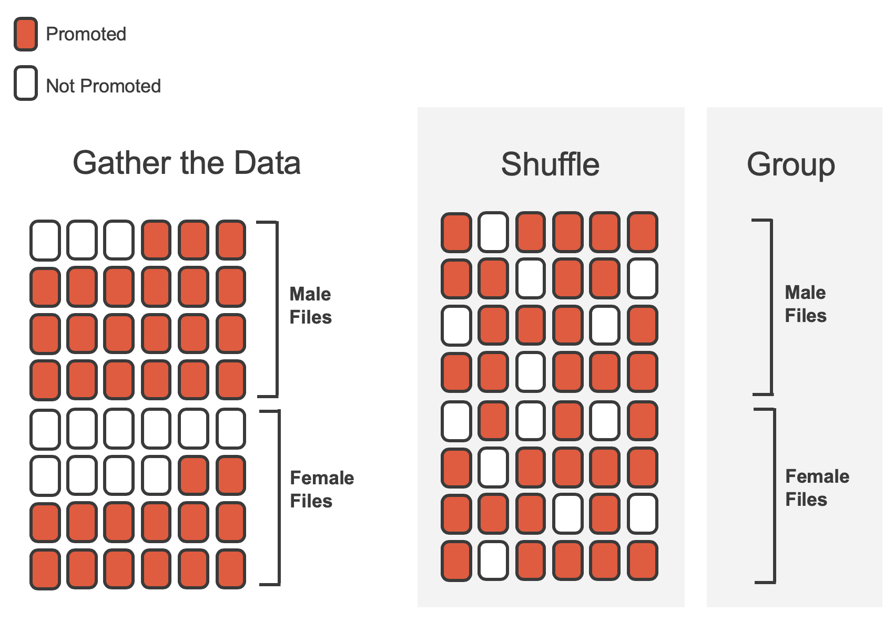
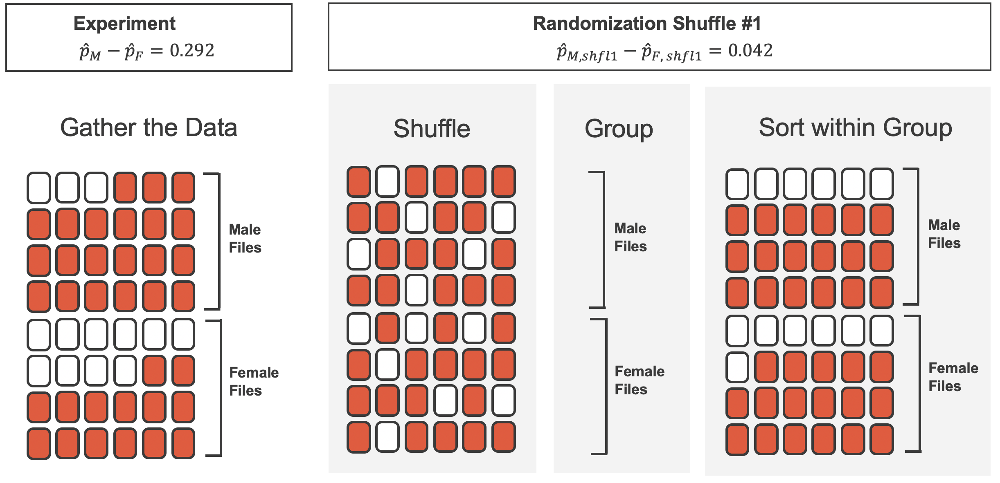

  


  
```{r packages, echo=FALSE, message=FALSE, warning=FALSE}
library(tidyverse)
library(unvotes)
library(knitr)
library(broom)
library(patchwork)
library(ggpubr)
library(scales) # label_dollar 
library(quantreg) # rq
library(kableExtra)
library(openintro)
library(infer)
library(gghighlight)

hook_output <- knit_hooks$get("output")
knit_hooks$set(output = function(x, options) {
  lines <- options$output.lines
  if (is.null(lines)) {
    return(hook_output(x, options))  # pass to default hook
  }
  x <- unlist(strsplit(x, "\n"))
  more <- "..."
  if (length(lines)==1) {        # first n lines
    if (length(x) > lines) {
      # truncate the output, but add ....
      x <- c(head(x, lines), more)
    }
  } else {
    x <- c(more, x[lines], more)
  }
  # paste these lines together
  x <- paste(c(x, ""), collapse = "\n")
  hook_output(x, options)
})

knitr::opts_chunk$set(comment = NA) # makes it so the ## doesnt appear in output for chunks

source("../_common.R")

library(xaringanthemer)
# style_mono_light(base_color = "#23395b")
style_mono_accent(base_color = "#23395b")

```
.pull-left[ 
* *Statistical inference* is concerned with understanding and quantifying *uncertainty* in estimation
* We'll first discuss the *hypothesis testing* framework: allows for formally evaluating claims about populations
* Notation: $p$ to denote population proportion (e.g. proportion of population supporting some policy), $\hat p$ to dentoe *sample* proportion (e.g. taking a survey  of 1,000 people on whether they support a policy)
* $\mu$ denotes population mean (e.g., average height of all US citizens) and $\bar x$ to denote sample mean (e.g., average height of students in this classroom)

]

.pull-right[
* The goal of inference is to quantify how likely certain outcomes are due to random chance vs. due to real differences.
* Think through what would happen if we repeatedly took different surveys of people's opinions on support for some political policy.
* Sample to sample, there is going to be some natural variation, but if there is a big difference in support for vs. against the policy, this randomness will be drowned out by the true difference in the population preference.
* We will be formalizing this in the coming lectures.
]


---
.pull-left[ 
### 1970s Discrimination Study
* We will look at a study investigating sex discrimination in the 1970s
* Question we investigate: "Are individuals who identify as female discriminated against in promotion decisions made by their managers who identify as male?"
```{r}
openintro::sex_discrimination %>% str
table(sex_discrimination)
```

]

.pull-right[
<!-- * Note that we only have a single variable, and this is *observational data*.  Without a truly randomized study, with care taken to ensure that the two groups (here: male/female) are equal among other characteristics (e.g. seniority, number of years worked, etc.) our statistical inference may not be valid.  But let us -->
* We can formulate two competing claims about the relationship between sex and promotions:
  - $H_0$, **Null hypothesis**: variables `sex` and `decision` are independent.  Any observed differences in proportions promoted are due to natural variability   
  - $H_A$, **Alternative hypothesis**: variables `sex` and `decision` are *dependent*.  Observed differences in proportions are due to dependence between the two variables.
* Note that we only have a single variable, and this is *observational data*.  Without a truly randomized study, with care taken to ensure that the two groups (here: male/female) are equal among other characteristics (e.g. seniority, number of years worked, etc.), we cannot say that sex *caused* differences in hiring outcomes.  
]

---
.pull-left[

### Variability of the statistic
* $H_0$, **Null hypothesis**: variables `sex` and `decision` are independent.  Any observed differences in proportions promoted are due to natural variability   
* We can examine whether this hypothesis is true by using a **permutation test**.
* If the two variables were independent, then if we shuffled all of the labels of "male" and "female", then the proportion with each `decision` would be the same
* If the proportion within each decision are very different than in the sample that we saw, then there is evidence that the null hypothesis is *not* true
```{r}
table(sex_discrimination)
```

]

.pull-right[

```{r,echo=FALSE, out.width="80%"}

```
* In this simulation, we have fixed the number of males and females, as well as number of promoted / not promoted, but shuffled the labels of male/female
```{r, echo=FALSE,warning=FALSE,message=FALSE}
#| label: tbl-sex-discrimination-rand-1
#| tbl-cap: |
#|   Simulation results, where the difference in promotion rates between male 
#|   and female is purely due to random chance.
library(janitor)
sex_discrimination_rand_1 <- tibble(
  sex   = c(rep("male", 24), rep("female", 24)),
  decision = c(rep("promoted", 18), rep("not promoted", 6),
               rep("promoted", 17), rep("not promoted", 7))
) |>
  mutate(
    sex   = fct_relevel(sex, "male", "female"),
    decision = fct_relevel(decision, "promoted", "not promoted")
  )
  
sex_discrimination_rand_1 |> 
  count(decision, sex) |> 
  pivot_wider(names_from = decision, values_from = n) |>
  adorn_totals(where = c("col", "row")) |> 
  kbl(linesep = "", booktabs = TRUE) |>
  kable_styling(bootstrap_options = c("striped", "condensed"), 
                latex_options = c("striped", "hold_position"), full_width = FALSE) |>
  add_header_above(c(" " = 1, "decision" = 2, " " = 1)) |>
  column_spec(1:4, width = "7em")
```

]

---
.pull-left[
### Observed statistic vs. null statistics
* We can continue to do different simulations of the data to see what is the general distribution of the null statistic


```{r}
#| out-width: 100%

```
]

.pull-right[
```{r, echo=FALSE}
#| label: fig-sex-rand-dot-plot
#| fig-cap: |
#|    A stacked dot plot of differences from 100 simulations produced under 
#|    the null hypothesis, $H_0,$ where the simulated sex and decision are 
#|    independent. Two of the 100 simulations had a difference of at least 
#|    29.2%, the difference observed in the study, and are shown as solid dots.
#| fig-alt: A stacked dot plot of the 100 simulated differences between the 
#|   proportion of male and female files recommended for promotion.  The differences
#|   were simulated under the null hypothesis that there was no discrimination.
#|   Two of the 100 simulations had a difference of 29.2% and are colored in blue
#|   to indicate that they are as or more extreme than the observed difference.
#| out-width: 100%

set.seed(37)
sex_discrimination |>
  specify(decision ~ sex, success = "promoted") |>
  hypothesize(null = "independence") |>
  generate(reps = 100, type = "permute") |>
  calculate(stat = "diff in props", order = c("male", "female")) |>
  mutate(stat = round(stat, 3)) |>
  ggplot(aes(x = stat)) +
  geom_dotplot(binwidth = 0.01) +
  gghighlight(stat >= 0.292) +
  theme(
    axis.ticks.y = element_blank(),
    axis.text.y = element_blank()
  ) +
  labs(
    x = "Differences in promotion rates (male - female) across many shuffles",
    y = NULL
  )
```
* Under null hypothesis, expect average of 0 diff.
* The 0.292 observed is unlikely, suggests that hiring and sex were *not* independent 
]

---

.pull-left[
### Example: college student savings
* Let's consider a study where we ask whether telling a college student that they can save money for later purchases will make them spend less now
-   $H_0:$ **Null hypothesis**. Reminding students that they can save money for later purchases will not have any impact on students' spending decisions.
-   $H_A:$ **Alternative hypothesis**. Reminding students that they can save money for later purchases will reduce the chance they will continue with a purchase.
* Dataset: `opportunity_cost` in *openintro*
```{r}
opportunity_cost
```

]

.pull-right[
*"Imagine that you have been saving some extra money on the side to make some purchases, and on your most recent visit to the video store you come across a special sale on a new video. This video is one with your favorite actor or actress, and your favorite type of movie (such as a comedy, drama, thriller, etc.). This particular video that you are considering is one you have been thinking about buying for a long time. It is available for a special sale price of $14.99. What would you do in this situation? Please circle one of the options below."*

Half of the 150 students were randomized into a control group and given the following options:

> (A) Buy this entertaining video.

> (B) Not buy this entertaining video.

Remaining 75 students were placed in treatment group, they saw: 

> (A) Buy this entertaining video.

> (B) Not buy this entertaining video. Keep the $14.99 for other purchases.

```{r}
table(opportunity_cost)
```

]

---
.pull-left[

```{r}
#| echo: false
table(opportunity_cost)
ggplot(opportunity_cost, aes(y = fct_rev(group), fill = fct_rev(decision))) +
  geom_bar(position = "fill") +
  scale_fill_openintro("two") +
  scale_x_continuous(labels = label_percent()) +
  labs(
    x = "Proportion",
    y = "Group",
    fill = "Decision"
    )

opportunity_cost |> 
  count(group, decision) |> 
  pivot_wider(names_from = decision, values_from = n) |>
  adorn_percentages(denominator = "row") |>
  adorn_totals(where = "col") |>
  kbl(linesep = "", booktabs = TRUE) |>
  kable_styling(bootstrap_options = c("striped", "condensed"), 
                latex_options = c("striped", "hold_position"), full_width = FALSE) |>
  add_header_above(c(" " = 1, "decision" = 2, " " = 1))  |>
  column_spec(1:4, width = "7em")
```

]

.pull-right[
* We see that under treatment, about 20 percentage points higher choose not to buy the video
* How much variability would one expect if the treatment had no effect?  
* We can do the same type of analysis from the previous setting
  - Assume we have 53 people labeled "not buy video", 97 labeled "buy video"
  - Imagine we have index cards with these labels, then we shuffle them and divide into two stacks of 75 people each
  - We imagine each stack is a new "control" and "treatment" group
  - Any difference between proportions of "buy" and "not buy" cards will be due entirely to random chance 
  - We should generally expect each stack to have $53/2\approx 26$ "not buy" cards each
  
]

---

.pull-left[
* Let's look at a single randomization
```{r}
#| echo: false

opportunity_cost_rand_1 <- tibble(
  group = c(rep("control", 75), rep("treatment", 75)),
  decision = c(
    rep("buy video", 46), rep("not buy video", 29),
    rep("buy video", 51), rep("not buy video", 24)
  )
) |>
  mutate(
    group = as.factor(group),
    decision = as.factor(decision)
  )

opportunity_cost_rand_1 |> 
  count(group, decision) |> 
  pivot_wider(names_from = decision, values_from = n) |>
  adorn_totals(where = c("col", "row")) |> 
  kbl(linesep = "", booktabs = TRUE) |>
  kable_styling(bootstrap_options = c("striped", "condensed"), 
                latex_options = c("striped", "hold_position"), full_width = FALSE) |>
  add_header_above(c(" " = 1, "decision" = 2, " " = 1)) |>
  column_spec(1:4, width = "7em")
```

From this table, we can compute a difference that occurred from the first shuffle of the data (i.e., from chance alone):

$$\hat{p}_{T, shfl1} - \hat{p}_{C, shfl1} = \frac{24}{75} - \frac{29}{75} = - 0.067$$
* Compare this to the 20 percentage points (0.2) that we saw before.
* We can repeat 1000x times and plot the results on the right.
]

.pull-right[

```{r}
#| label: fig-opportunity-cost-rand-hist
#| echo: false
#| fig-cap: |
#|   A histogram of 1,000 chance differences produced under the null hypothesis.

set.seed(25)
opportunity_cost_rand_dist <- opportunity_cost |>
  specify(decision ~ group, success = "not buy video") |>
  hypothesize(null = "independence") |>
  generate(reps = 1000, type = "permute") |>
  calculate(stat = "diff in props", order = c("treatment", "control")) |>
  mutate(stat = round(stat, 3)) 

ggplot(opportunity_cost_rand_dist, aes(x = stat)) +
  geom_histogram(binwidth = 0.04) +
  gghighlight(stat >= 0.20) +
  labs(
    title = "1,000 differences in randomized proportions",
    x = "Difference in randomized proportions of students who\ndo not buy the video (treatment - control)",
    y = "Count\n(Number of simulated scenarios)"
  )
```
* Thus getting differences of 0.2 are very unlikely if the "buy" and "not buy" outcomes were independent of the treatment (being reminded that you can save money for later)
* Only 6 of the 1,000 randomizations had as extreme a result 
]


---

.pull-left[
### Hypothesis testing
* In previous problems, we described a *hypothesis test*:
  - **Null hypothesis**: default assumption, skeptical, belief that things could have happened due to change
  - **Alternative hypothesis**: hypothesis that there is some relationship between variables
  
* Way to think about it: trial by jury
  - Null hypothesis is not guilty.
  - Alternative hypothesis of guilty is only put forward if there is significant evidence in favor of this claim.
  - Failure to reject the null does NOT mean null is true, just that we don't have enough evidence to reject the null
]

.pull-right[
### p-values and statistical significance
* $p$-value represents the probability that, if the null hypothesis is true and a linear model is the correct model of the data, that we would obtain data that is at least as extreme as the result actually observed
* Think back to the example about sex discrimination: when we took 100 randomizations of the data, we got only 2/100 simulations which resulted in promotion rates as extreme as what we observed in the original data
```{r, echo=FALSE}
#| fig-width: 4
sex_discrimination |>
  specify(decision ~ sex, success = "promoted") |>
  hypothesize(null = "independence") |>
  generate(reps = 100, type = "permute") |>
  calculate(stat = "diff in props", order = c("male", "female")) |>
  mutate(stat = round(stat, 3)) |>
  ggplot(aes(x = stat)) +
  geom_dotplot(binwidth = 0.01) +
  gghighlight(stat >= 0.292) +
  theme(
    axis.ticks.y = element_blank(),
    axis.text.y = element_blank()
  ) +
  labs(
    x = "Diff. in promotion rates (M-F) across shuffles",
    y = NULL
  )
```

]

---
.pull-left[
### p-values and statistical significance
* $p$-value represents the probability that, if the null hypothesis is true and a linear model is the correct model of the data, that we would obtain data that is at least as extreme as the result actually observed
* When the $p$-value is smaller than a threshold (**significance level** $\alpha$), then we say results are *statistically significant at level $\alpha$*), and we reject the null hypothesis in favor of the alternative
* Example: in video experiment, we showed that participants had a 20% drop in likelihood of purchasing if we remind about saving money.
  - Only 6/1,000 had as extreme a result --> p value of 0.006 < 0.05. 
  - Statistically significant at level 0.01
]

--
.pull-right[
### Randomization tests summary
* Frame research qeustion in terms of hypotheses
  - Null hypothesis $H_0$: skeptical of any relationship between variables
  - Alternative hypothesis $H_A$: posits a relationship between variables
* Collect data
* Model randomness that would occur if null hypothesis were true
  - Randomize treatments
* Analyze data and identify $p$-value
* Form conclusion about hypotheses using $p$-value 
]

---

.pull-left[
#### Examples
* Let's describe null and alternative hypotheses in words and symbols for the following:
  - Starting in 2008, chain restaurants in Calif. have displayed calorie coutns for each menu item
  - Before 2008, we randomly sampled restaurants and recorded whether a person consumed > 2000 calories at the chain restaurant
  - After 2008, we returned and again randomly sampled restaurants and recorded whether a person consumed > 2000 calories at the chain restaurant
  - We want to see if the data provide convincing evidence of a difference in average calorie intake
]

--

.pull-right[
* **Null hypothesis** $H_0$: calorie intake is the independent of whether we display number of calories per item.
* **Alternative hypothesis** $H_A$: calorie intake is affected by display of number of calories per item.

Let's suppose we had data as follows:

|  | No cal. display | Cal. display | Total |
| -------- | --------- | ------- | ----- |
| >2000 cal | 825 | 350 | 1175 |
| <2000 cal | 1605 | 1800 | 3605 | 
| Total | 2430 | 2150 | 4580 |


Convert this into proportions:

|  | No calorie display | Calorie display | 
| -------- | --------- | ------- |
| >2000 cal | 0.339 | 0.163 | 
| <2000 cal | 0.661 | 0.837 | 

* *Treatment* here is having calorie display
]

---

.pull-left[

|  | No calorie display | Calorie display | 
| -------- | --------- | ------- |
| >2000 cal | 0.339 | 0.163 | 
| <2000 cal | 0.661 | 0.837 | 

* *Treatment* here is having calorie display
* We see a difference in proportion eating >2000 calories as:
$$ 0.163 - 0.339 = -0.176 $$
* How likely would this have happened if the calorie display did not affect how much people ate?
]

.pull-right[
* We simulate below 200 different randomizations of the data, keeping the total number of >2000 and <2000 cal fixed but randomly assigning "no calorie display" and "display" to the groups.
```{r, echo = FALSE}
#| fig-width: 5
#| 
eating <- tibble(
  group = c(rep("no_display", 2430),
            rep("display", 2150)),
  ate = c(rep(">2000cal", 825),
          rep("<2000cal", 1605),
          rep(">2000cal", 350),
          rep("<2000cal", 1800))
  ) %>% 
  mutate(group = as.factor(group),
         ate = as.factor(ate))

eating |>
  specify(ate ~ group , success = "<2000cal") |>
  hypothesize(null = "independence") |>
  generate(reps = 200, type = "permute") |>
  calculate(stat = "diff in props", order = c("no_display", "display")) |>
  mutate(stat = round(stat, 4)) |>
  ggplot(aes(x = stat)) +
  geom_dotplot(binwidth = 0.002) +
  gghighlight(stat < -0.176) +
  theme(
    axis.ticks.y = element_blank(),
    axis.text.y = element_blank()
  ) +
  labs(
    x = "Difference in proportions",
    y = NULL
  )

```

* We see that the typical difference in proportions is never as much as what we observed (-0.176), so there is significant evidence to reject the null hypothesis
* The simulation has 200 instances and none of them result in differences < -0.176, so we can say the p value is < 1/200 = 0.005. 
]

---

### Confidence intervals with bootstrapping
.pull-left[
* We'll now talk a bit about *confidence intervals*: core idea is to use a sample proportion to estimate a population proportion
* Provides a plausible range of values where we expect to find the true population proportion
* We saw how to use randomization to see whether difference in sample proportions was due to chance  -- useful for yes/no questions, like
  -- Does this vaccine make it less likely to get a disease
  -- Does drinking caffeine affect athletic performance
  
* We will now talk about how to *estimate* the value of an unknown parameter, e.g.
  -- How much less likely am I to get a disease if I get a vaccine
  -- How much faster can I run if I have caffeine

]

.pull-right[
* The technique we'll focus on is called **bootstrapping*
* Goal is to understand the variability inherent in a statistic (e.g., the sample mean)
* If we can understand how different sample means are from the population mean, then we can make decisions about what was due to random chance vs. what is a true property of the population

]

---

.pull-left[ 
#### Medical consultant study
* Let's consider the following setting: People seek out a medical consultant for navigating the donation of a liver.
* One consultant claims that although the average complication rate for liver donor surgeries is 10%, her clients have only had 3 complications in the 62 liver surgeries she has facilitated
* Is this strong evidence that her work meaningfully contributes to reduced complications?
* Let $p$ = true complication rate for liver donors working with the consultant
* We estimate $p$ using data, label estimate as $\hat p$
* In this sample, complication rate is $3/62 = 0.048 = \hat p$. 
]

.pull-right[
* It is NOT possible to assess the consultant's claim using this data.
* The claim is about a *causal* connection, but we are only looking at *observational data*.
* There could be confounders (e.g. she refuses to take patients that are likely to have failed surgeries; or those which have medical consultants are richer / healthier and result in fewer complications)
* What we *can* do is to get a sense of the consultant's true rate of complications.
]

---

.pull-left[
#### Bootstrapping: the main idea
* Suppose we have $x_1, \dots, x_n$ as a random sample from a population
* If we **resample** subsets of these examples (with replacement), this "mimics" as if we sample from the true population
* For the medical consultant setting, this means imagining we have a big bucket of index cards, with 3 that say "complication" and 59 that say "no complication"
* We shuffle the bucket, reach in, record what it says, then put the card *back into the bucket*, and continue
* Since we are randomly sampling from our *subsample*, and the initial subsample was a random sample, we can get an idea of sample-to-sample randomness
]

.pull-right[
```{r,echo=FALSE}
#| fig-width: 5
knitr::include_graphics("boot1prop2.png")
```
]

---


```{r,echo=FALSE,out.width='80%'}
knitr::include_graphics("boot1propboth.png")
```


---

.pull-left[
* So let's look at what happens if we take 10,000 bootstrap samples of the medical consultant data.
* Remember that original data had 62 observations, 3 of which had "complications"; $\hat p = 3/62 \approx 0.0484$. 


```{r, echo=FALSE}
#| label: fig-MedConsBSSim

bsprop_med <- tibble(
  bsprop = rbinom(10000, size = 62, prob = (3 / 62)) / 62
)

bsprop_med_summary <- bsprop_med |>
  summarise(
    bsprop_025 = quantile(bsprop, 0.025),
    bsprop_975 = quantile(bsprop, 0.975),
  )

ggplot(bsprop_med, aes(x = bsprop)) +
  geom_histogram(binwidth = 0.0075) +
  gghighlight(bsprop <= bsprop_med_summary$bsprop_025 | bsprop >= bsprop_med_summary$bsprop_975) +
  annotate("segment",
    x = bsprop_med_summary$bsprop_025, y = 0,
    xend = bsprop_med_summary$bsprop_025, yend = 1000,
    linetype = "dashed"
  ) +
  annotate("segment",
    x = bsprop_med_summary$bsprop_975, y = 0,
    xend = bsprop_med_summary$bsprop_975, yend = 1000,
    linetype = "dashed"
  ) +
  annotate("text", x = bsprop_med_summary$bsprop_025, y = 1200, label = "2.5th\npercentile") +
  annotate("text", x = bsprop_med_summary$bsprop_975, y = 1200, label = "97.5th\npercentile") +
  labs(
    x = "Bootstrapped proportion of surgical complications",
    y = "Count",
    title = "10,000 bootstrapped proportions"
  )
```

]

.pull-right[
* Since the 2.5% percentile is at 0, 97.5th percentile at 0.113, we are confident that in the population, the true probability of a complication from the medical consultant is between 0% and 11.3%.
* We were asked to compare this to the national rate of 10%.
* Since our interval of 0-11.3% *includes* 10%, we cannot say that the consultant's work was associated with a lower risk of complications -- it could just be randomness
* Even if the interval did not include 10%, we could not make a claim about causality. 
]

---

.pull-left[
#### Example: tappers and listeners
* Consider this study: a person conducts an experiment using the "tapper-listener" game.
* Goal: pick a simple, well-known song; tap the tune on your desk; and see if the other person can guess the song
* Data: 120 tappers, 120 listeners, 50% of tappers expected the listener would be able to guess the song.
  - Is 50% a reasonable guess?
  - In study, 3 / 120 ($\hat p = 0.025$) listeners were able to guess the song
  - Given this, what are typical values one could expect for the proportion?
* We can use bootstrapping as before: imagine we have a jar with 120 marbles, 3 are green (guessed correctly) and 117 are red (could not guess the song)
]
.pull-right[
* Bootstrapping corresponds to shuffling the jar, grabbing a marble, recording the response, then putting the marble back in, and repeating; e.g. the first 5 times we get

|   W   |   W   |   W   |    R    |   W   |
|:-----:|:-----:|:-----:|:-------:|:-----:|
| Wrong | Wrong | Wrong | Correct | Wrong |


* We repeat this 10,000 times and visualize: 

```{r}
#| label: fig-tappers-bs-sim
#| echo: false
#| 
bsprop_tap <- tibble(
  bsprop = rbinom(10000, size = 120, prob = (3 / 120)) / 120
)

bsprop_tap_summary <- bsprop_tap |>
  summarise(
    bsprop_025 = quantile(bsprop, 0.025),
    bsprop_975 = quantile(bsprop, 0.975),
  )

ggplot(bsprop_tap, aes(x = bsprop)) +
  geom_histogram(binwidth = 0.0045) +
  gghighlight(bsprop <= bsprop_tap_summary$bsprop_025 | bsprop >= bsprop_tap_summary$bsprop_975) +
  annotate("segment",
    x = bsprop_tap_summary$bsprop_025, y = 0,
    xend = bsprop_tap_summary$bsprop_025, yend = 1000,
    linetype = "dashed"
  ) +
  annotate("segment",
    x = bsprop_tap_summary$bsprop_975, y = 0,
    xend = bsprop_tap_summary$bsprop_975, yend = 1000,
    linetype = "dashed"
  ) +
  annotate("text", x = bsprop_tap_summary$bsprop_025, y = 1200, label = "2.5th\npercentile") +
  annotate("text", x = bsprop_tap_summary$bsprop_975, y = 1200, label = "97.5th\npercentile") +
  labs(
    x = "Bootstrapped proportion of listeners who guessed correctly",
    y = "Count",
    title = "10,000 bootstrapped proportions"
  )
```
* Expect between 0-5.83% are able to guess tapper's tune 


]

---
.pull-left[
#### Bootstrap confidence interval
* **Confidence interval**: plausible range of values for population parameter $p$
* Bootstrap procedure: if we have $n$ samples, responses in two categories, with initial estimated proportion $\hat p$ for proportion in category #1
  - Randomly sample $n$ examples **with replacement** (think of a jar of marbles, colored according to response, shuffling and taking out a single marble then replacing it, repeat $n$ times)
  - Each time we randomly sample $n$ observations with replacement, we get the $i$-th "bootstrap sample", each one with a different estimate $\hat p_{boot, i}$
  - We examine the **distribution** of the $\hat p_{boot, i}$ (dot plot, histogram, ...)
]

.pull-right[
  - All the $\hat p_{boot,i}$ will be centered around baseline $\hat p$
  - Original $\hat p$ is centered around the population $p$
  - Thus interval estimate for $p$ can be computed using $\hat p_{boot, i}$
* More formally, the 95% bootstrap confidence interval for parameter $p$ can be estimated using the (ordered) $\hat p_{boot, i}$ values
* Call $a$= 2.5% bootstrapped proportion, $b$= 97.5% bootstrapped proportion
* 95% bootstrapped confidence interval: $(a, b)$ = those values between $a$ and $b$
]

---

.pull-left[
#### Example: Youtube Videos
* Want to estimate proportion of YouTube videos taking place outdoors
* We sample 128 videos and find 37 take place outdoors
* Want to estimate proportion of all youtube videos which take place outside via bootstrap confidence interval; we get the following
```{r}
#| echo: false
tibble(videos = c(rep("inside", 91), rep("outdoors", 37))) %>%
  specify(response = videos, success = "outdoors") %>%
  generate(reps = 1000, type = "bootstrap") %>%
  calculate(stat = "prop") %>%
  ggplot(aes(x = stat)) +
  geom_histogram(binwidth = 0.0125, fill = IMSCOL["green", "full"]) +
  labs(
    x = "Bootstrapped proportion of outdoors videos", 
    y = "Count",
    title = "1,000 bootstrapped proportions"
  )
```

]

.pull-right[
* What is the relevant statistic and parameter for this problem?
  - Statistic: sample proportion $\hat p = 37/128 \approx 0.289$; parameter: population proportion ($p$; unknown)
* If we want to be 90% confident that between $a$% and $b$% of YouTube videos that take place outdoors, how should we find $a$ and $b$?
  - We want 5% of values to be below $a$, and 5% of values to be above $b$
  - The interval should be centered at $\hat p \approx 0.289$ (so, $\hat p = (a + b)/2$)
  - From the graph, we see that $a\approx 0.22$ and $b\approx 0.35$ is correct. 
]