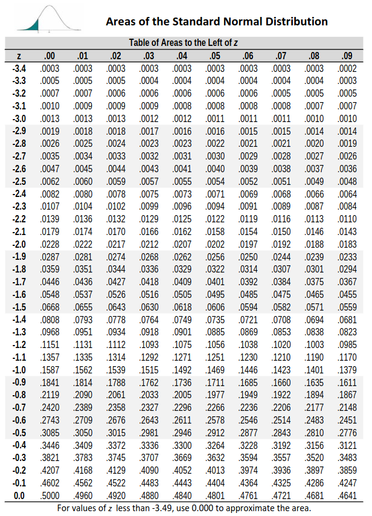

  


  
```{r packages, echo=FALSE, message=FALSE, warning=FALSE}
library(tidyverse)
library(unvotes)
library(knitr)
library(broom)
library(patchwork)
library(ggpubr)
library(scales) # label_dollar 
library(quantreg) # rq
library(kableExtra)
library(openintro)
library(infer)
library(gghighlight)

hook_output <- knit_hooks$get("output")
knit_hooks$set(output = function(x, options) {
  lines <- options$output.lines
  if (is.null(lines)) {
    return(hook_output(x, options))  # pass to default hook
  }
  x <- unlist(strsplit(x, "\n"))
  more <- "..."
  if (length(lines)==1) {        # first n lines
    if (length(x) > lines) {
      # truncate the output, but add ....
      x <- c(head(x, lines), more)
    }
  } else {
    x <- c(more, x[lines], more)
  }
  # paste these lines together
  x <- paste(c(x, ""), collapse = "\n")
  hook_output(x, options)
})

knitr::opts_chunk$set(comment = NA) # makes it so the ## doesnt appear in output for chunks

source("../_common.R")

library(xaringanthemer)
# style_mono_light(base_color = "#23395b")
style_mono_accent(base_color = "#23395b")

```
.pull-left[ 

### Inference with mathematical models 
* We've talked about how to do bootstrapping and randomization tests
* We'll now talk about how to use mathematical models to think about inference
* In both randomization and bootstrapping, we formed **sampling distributions**: distribution of all possibel values of a *sample statistics* from samples of a population
  * Describes how much sample statistics vary from one sample to another
  * Can only be visualized after using computational methods / mathematical models - a single dataset's observations do not suffice
  


]

.pull-right[
* In the four examples we described in last lectures, we ran 10,000 simulations under the null hypothesis
* We sampled 10,000 versions of the sample proportion under the null hypothesis
* *Sampling distribution* of sample proportion under the null hypothesis, i.e. **null distribution** 
```{r}
#| include: false
opportunity_cost_sim_dist <- opportunity_cost |>
  specify(response = decision, explanatory = group, success = "buy video") |>
  hypothesize(null = "independence") |>
  generate(reps = 10000, type = "permute") |>
  calculate(stat = "diff in props", order = c("treatment", "control"))

sex_discrimination_sim_dist <- sex_discrimination |>
  specify(response = decision, explanatory = sex, success = "promoted") |>
  hypothesize(null = "independence") |>
  generate(reps = 10000, type = "permute") |>
  calculate(stat = "diff in props", order = c("male", "female"))  

medical_consultant_sim_dist <- tibble(stat = rbinom(10000, 62, 0.1)/62)

tappers_listeners_sim_dist <- tibble(stat = rbinom(10000, 120, 0.5)/120)
```


```{r}
#| fig-asp: 0.9
#| echo: false
#| warning: false
#| message: false

# opportunity cost -------------------------------------------------------------

p_oc <- ggplot(opportunity_cost_sim_dist, aes(x = stat)) +
  geom_histogram(binwidth = 0.013, fill = IMSCOL["blue", "full"]) +
  scale_x_continuous(breaks = seq(-0.3, 0.3, 0.1), labels = label_number(accuracy = 0.1), limits = c(-0.35, 0.35)) +
  theme(
    axis.text.y = element_blank(),
    panel.grid = element_blank()
  ) +
  labs(x = expression(H[0]:~p[T] - p[C] == 0), y = NULL) +
  annotate("rect", xmin = -0.13, xmax = 0.13, ymin = 150, ymax = 450, fill = "white", alpha = 0.5) +
  annotate("text", x = 0, y = 300, label = "Opportunity cost", size = 6)

# sex discrimination ----------------------------------------------------------

p_gd <- ggplot(sex_discrimination_sim_dist, aes(x = stat)) +
  geom_histogram(binwidth = 0.04, fill = IMSCOL["green", "full"]) +
  scale_x_continuous(breaks = seq(-0.6, 0.6, 0.2), labels = label_number(accuracy = 0.1), limits = c(-0.6, 0.6)) +
  theme(
    axis.text.y = element_blank(),
    panel.grid = element_blank()
  ) +
  labs(x = expression(H[0]:~p[M] - p[F] == 0), y = NULL) +
  annotate("rect", xmin = -0.18, xmax = 0.18, ymin = 250, ymax = 750, fill = "white", alpha = 0.5) +
  annotate("text", x = 0, y = 500, label = "Sex discrimination", size = 6)

# medical consultant -----------------------------------------------------------

p_mc <- ggplot(medical_consultant_sim_dist, aes(x = stat)) +
  geom_histogram(binwidth = 0.016, fill = IMSCOL["red", "full"]) +
  scale_x_continuous(breaks = seq(-0.1, 0.3, 0.05), labels = label_number(accuracy = 0.01), limits = c(-0.1, 0.30)) +
  theme(
    axis.text.y = element_blank(),
    panel.grid = element_blank()
  ) +
  labs(x = expression(H[0]: ~ p == 0.1), y = NULL) +
  annotate("rect", xmin = 0, xmax = 0.2, ymin = 200, ymax = 600, fill = "white", alpha = 0.5) +
  annotate("text", x = 0.10, y = 400, label = "Medical consultant", size = 6)

# tappers and listeners --------------------------------------------------------

p_tl <- ggplot(tappers_listeners_sim_dist, aes(x = stat)) +
  geom_histogram(binwidth = 0.016, fill = IMSCOL["yellow", "full"]) +
  scale_x_continuous(breaks = seq(0.30, 0.70, 0.05), labels = label_number(accuracy = 0.01), limits = c(0.3, 0.7)) +
  theme(
    axis.text.y = element_blank(),
    panel.grid = element_blank()
  ) +
  labs(x = expression(H[0]: ~ p == 0.5), y = NULL) +
  annotate("rect", xmin = 0.3, xmax = 0.7, ymin = 150, ymax = 450, fill = "white", alpha = 0.5) +
  annotate("text", x = 0.5, y = 300, label = "Tappers + listeners", size = 6)

(p_oc + p_gd) /
  (p_mc + p_tl)
```
]

---
.pull-left[
#### The central limit theorem and normal distributions
* Whenever we look at a population and take enough *independent* samples, then the sample proportion/mean will follow a **normal distribution**: a bell-shaped curve that looks like
```{r}
#| label: fig-er6895997
#| fig-asp: 0.8
#| echo: false

X <- seq(-4, 4, 0.01)
Y <- dnorm(X)
plot(X, Y, type = "n", axes = F, ylim = c(0, 0.4), xlim = c(-3.2, 3.2), xlab = NA, ylab = NA)
abline(h = 0, col = IMSCOL["black", "full"])
axis(1, at = -3:3, label = expression(
  mu - 3 * sigma, mu - 2 * sigma, mu - sigma, mu,
  mu + sigma, mu + 2 * sigma, mu + 3 * sigma
))
ii <- c(1, 2, 3)
jj <- c(1, 1, 1)
for (i in 3:1) {
  these <- (X >= i - 1 & X <= i)
  polygon(c(i - 1, X[these], i), c(0, Y[these], 0), col = IMSCOL[ii[i], jj[i]], border = IMSCOL[ii[i], jj[i]])
  these <- (X >= -i & X <= -i + 1)
  polygon(c(-i, X[these], -i + 1), c(0, Y[these], 0), col = IMSCOL[ii[i], jj[i]], border = IMSCOL[ii[i], jj[i]])
}
# ===> label 99.7 <===#
arrows(-3, 0.03, 3, 0.03, code = 3, col = "#444444", length = 0.15)
text(0, 0.02, "99.7%", pos = 3)
# ===> label 95 <===#
arrows(-2, 0.13, 2, 0.13, code = 3, col = "#444444", length = 0.15)
text(0, 0.12, "95%", pos = 3)
# ===> label 68 <===#
arrows(-1, 0.23, 1, 0.23, code = 3, col = "#444444", length = 0.15)
text(0, 0.22, "68%", pos = 3)
lines(X, Y, col = "#888888")
abline(h = 0, col = "#AAAAAA")
```
* $\mu$ is the mean (or proportion) for the population; $\sigma$ is "standard deviation"
* This idea is called "central limit theorem" 
]

.pull-right[
* Values of $\mu$, $\sigma$ may change from plot to plot, but the shape remains the same
* The sample proportion $\hat p$ will look like a normal distribution centered at population proportion $p$ provided:
  - The observations in the sample are *independent*: samples are truly randomly sampled from a population
  - Sample size is *large enough*: we can make this exact, but generally need >= 10 observed examples in each class (treatment/control)
* Same ideas hold for sample mean $\bar x$: centered at population mean $\mu$
]

---

.pull-left[

#### Normal distribution model
* Symmetric, unimodal, bell-shaped.
* Exact values of center / spread can change.
* Mean $\mu$ shifts from left to right, standard deviation $\sigma$ squishes to be larger or smaller

```{r}
#| label: fig-twoSampleNormals
#| fig-alt: Two normal curves. The first one has a mean at zero
#|   with a standard deviation of one and is called the standard
#|   normal distribution.  The second one has a mean 
#|   at 19 with a standard deviation of four.
#| fig-asp: 0.3
#| out-width: 100%
#| echo: false
#| warning: false
#| message: false

normals <- tibble(
  x = c(rnorm(10000, mean = 0, sd = 1), rnorm(10000, mean = 19, sd = 4)),
  group = c(rep(1, 10000), rep(2, 10000))
)

p1 <- ggplot(normals |> filter(group == 1), aes(x = x)) +
  geom_histogram(aes(y=..density..), alpha = 0.5) +
  geom_function(fun = dnorm, args = list(mean = 0, sd = 1), color = IMSCOL["blue", "full"], size = 1) +
  labs(y = NULL, x = NULL) +
  scale_x_continuous(breaks = -3:3) +
  theme(
    axis.text.y = element_blank(),
    panel.grid = element_blank()
  )

p2 <- ggplot(normals |> filter(group == 2), aes(x = x)) +
  geom_histogram(aes(y=..density..), alpha = 0.5, fill = IMSCOL["green", "full"]) +
  geom_function(fun = dnorm, args = list(mean = 19, sd = 4), color = IMSCOL["green", "full"], size = 1,
                linetype = "dashed") +
  labs(y = NULL, x = NULL) +
  scale_x_continuous(breaks = 19 + 4*(-3:3)) +
  theme(
    axis.text.y = element_blank(),
    panel.grid = element_blank()
  )

p1 + p2
```

```{r}
#| label: fig-twoSampleNormalsStacked
#| fig-asp: 0.3
#| out-width: 100%
#| echo: false
#| message: false
#| warning: false

ggplot(normals, aes(x = x)) +
  geom_function(fun = dnorm, args = list(mean = 0, sd = 1), color = IMSCOL["blue", "full"], size = 1) +
  geom_function(fun = dnorm, args = list(mean = 19, sd = 4), color = IMSCOL["green", "full"], size = 1, linetype = "dashed") +
  labs(y = NULL, x = NULL) +
  theme(
    axis.text.y = element_blank(),
    panel.grid = element_blank()
  )
```
]

.pull-right[
* We denote "normal distribution with mean $k$ and standard deviation $r$ as $N(\mu = k, \sigma = r)$.
  - If $k=0$, $r=1$, i.e. $N(\mu=0, \sigma=1)$, we call this the "standard normal distribution" 
  - Left has $N(\mu=0, \sigma=1)$ and $N(\mu=19, \sigma=4)$. 
* The way to quantify how "unusual"/"extreme" an event was is to look at how many standard deviations $\sigma$ away from the mean $\mu$ the quantity is. 
* This is called the $Z$ score:
$$ Z := \frac{ x - \mu}{\sigma}. $$
* E.g. which is more extreme: value of 27 for $N(\mu=19, \sigma=4)$ or value of 3 for $N(\mu=0, \sigma=1)$?
  - 27 for $N(\mu=19, \sigma=4)$: Z-score of $\frac{27-19}{4} = 2$.
  - 3 for $N(\mu=0, \sigma=1)$: Z-score of $\frac{3-0}{1} = 3$.
    * This is more extreme
]
---

.pull-left[
#### Z-score examples
* SAT scores are approximately normal distribution with mean 1500 and standard deviation 300; ACT scores are approximately normal with mean 21 and standard deviation 5.
* If Maria scored 1800 on the SAT and Abed scored 24 on the ACT, who performed better?
  - Z-score for Maria: (1800 - 1500) / 300 = 1
  - Z-score for Abed: (24 - 21) / 5 = 0.6
  - Maria did better on the exam
* What score corresponds to a z-score of 2.5 in each of the SAT and ACT?
  - SAT: 1500 + 2.5 * 300 = 1950
  - ACT: 21 + 2.5 * 5 = 33.5
]

.pull-right[
#### Normal probability calculations
* Suppose that Kavitha scored 1800 on her SAT.  How can they find what **percentile** this score is?  We know this corresponds to a Z-score of 1.
```{r}
#| label: fig-satBelow1800
#| fig-asp: 0.5
#| out.width: 85%
#| echo: false

normTail(m = 1500, s = 300, L = 1800, col = IMSCOL["blue", "full"])
```
* Total area under normal curve is always equal to 1.
* Proportion of people who scored below Kavitha is equal to the area of the shaded region. which we can calculate to be 0.8413 using a computer
* R and other statistical software can calculate probabilities/percentiles as a function of the z-score. 
]

---
.pull-left[
#### Normal probability calculations in R
* `pnorm()` function in base R provides percentile associated with a cutoff in the normal curve.  
  - E.g. Kavitha got 1800 on SAT, which has mean 1500 and sd 300:
```{r}
pnorm(1800, mean = 1500, sd = 300)
```

* `normTail()` function in **openintro** draws associated normal curve:
```{r}
#| fig-asp: 0.5
#| out-width: 60%
#| fig-align: center
normTail(m = 1500, s = 300, L = 1800)
```

]

.pull-right[
* We can also do the reverse calculation: identify the Z score associated with a percentile.
* `qnorm()`: identifies **quantile** for given percentage 
```{r}
qnorm(0.841, mean = 1500, sd = 300)
```
```{r}
#| fig-asp: 0.5
#| out-width: 60%
#| fig-align: center
normTail(m = 0, s = 1, L = 0.841)
```

* **quantile** and **percentile** are inverse operations:
```{r}
qnorm(pnorm(3, mean = 0, sd = 1), mean = 0, sd = 1)
pnorm(qnorm(0.99, mean = 5, sd = 3), mean = 5, sd = 3)
```


]

---

.pull-left[
#### Normal probability calculations
* Again consider SAT scores: normal, mean $\mu=1500$, s.d. $\sigma=300$.
* Suppose we take a random SAT taker.  What is the probability they score $\geq 1630$ on the SAT?
* Draw the normal curve and visualize the problem:

```{r}
#| label: fig-subtractingArea
#| echo: false
#| message: false
#| warning: false
par_og <- par(no.readonly = TRUE) # save original par
par(mar = c(0, 0, 0, 0), mfrow = c(2, 1))

normTail(m = 1500, s = 300, U = 1630, col = IMSCOL["blue", "full"])

X <- seq(-3.2, 3.2, 0.01)
Y <- dnorm(X)
plot(X, Y, type = "l", axes = F, xlim = c(-3.4, 16 + 3.4), ylim = c(0, 0.652))
lines(X, rep(0, length(X)))
these <- which(X <= 8)
polygon(c(X[these[1]], X[these], X[rev(these)[1]]), c(0, Y[these], 0), col = IMSCOL["blue", "full"])
lines(X, Y)
# abline(h=0)
lines(c(0, 0), dnorm(0) * c(0.01, 0.99), col = COL[6], lty = 3)
lines(c(3, 8 - 3), c(0.2, 0.2), lwd = 3)
text(0, 0.45, format(c(1, 0.0001), scientific = FALSE, digits = 4)[1], cex = 1)
lines(X + 8, Y, type = "l", xlim = c(-3.4, 3.4))
lines(X + 8, rep(0, length(X)))
these <- which(X <= 0.43)
polygon(c(X[these[1]], X[these], X[rev(these)[1]]) + 8, c(0, Y[these], 0), col = IMSCOL["blue", "full"])
lines(X + 8, Y)
lines(c(0, 0), dnorm(0) * c(0.01, 0.99), col = COL[6], lty = 3)
lines(8 + c(3, 8 - 3), c(0.23, 0.23), lwd = 3)
lines(8 + c(3, 8 - 3), c(0.17, 0.17), lwd = 3)
lines(c(3.72, 4.28), rep(0.45, 2), lwd = 2)
text(8, 0.45, format(0.6664, scientific = FALSE, digits = 4)[1], cex = 1)
lines(X + 8 + 8, Y, type = "l", xlim = c(-3.4, 3.4))
lines(X + 8 + 8, rep(0, length(X)))
these <- which(X > 0.43)
polygon(c(X[these[1]], X[these], X[rev(these)[1]]) + 8 + 8, c(0, Y[these], 0), col = IMSCOL["blue", "full"])
lines(X + 8 + 8, Y)
lines(c(0, 0), dnorm(0) * c(0.01, 0.99), col = COL[6], lty = 3)
text(12, 0.45, "=", cex = 1.5)
text(16, 0.45, format(0.3336, scientific = FALSE, digits = 4)[1], cex = 1)
par(par_og) # restore original par
```

]
.pull-right[
* Calculate Z score of 1630:
$$ Z = \frac{x - \mu}{\sigma} = \frac{1630 - 1500}{300} = 0.43.$$
* Then we want to calculate the **p**ercentile:
```{r}
pnorm(0.43, mean = 0, sd = 1)
pnorm(1630, mean = 1500, sd = 300)
```
* Thus proportion of 0.6664 have people with Z score **lower** than 0.43
* To compute area **above**, need to take one minus this (total area = 1)
  - Total proportion: $1-0.6664 = 0.3336$.
  - Probability of scoring at least 1630 is 0.3336, or 33.36%. 

]

---

.pull-left[
* Suppose Ed scored 1400 on his SAT.  What percentile is this?
* Draw a picture: 

```{r}
#| label: fig-edward-percentile
#| fig-asp: 0.5
#| out-width: 60%
#| echo: false
normTail(m = 1500, s = 300, L = 1400)
```
* Calculate Z score:
$$ Z = \frac{x - \mu}{\sigma} = \frac{1400 - 1500}{300} = -0.333.$$
* `pnorm()` returns percentile 
```{r}
pnorm(-0.3334, mean = 0, sd = 1)
pnorm(1400, mean = 1500, sd = 300)
```
* Edward did better than ~37% of SAT takers
]

.pull-right[
* Suppose the height of men is approx. normal with avg 70" and standard deviation 3.3"
* If Kamron is 5'7", Adrian 6'4", what percentile of men are their heights? Draw a picture and use `pnorm()` to calculate the percentage. 
  - 5'7" = 67"; 6'4" = 76" 

```{r}
#| label: fig-kamron-adrian-percentiles
#| echo: false
#| layout-ncol: 2
#| fig-asp: 0.5
#| out-width: 50%
#| fig-subcap:
#|   - Kamron
#|   - Adrian
normTail(70, 3.3, L = 67, col = IMSCOL["blue", "full"])
normTail(70, 3.3, L = 76, col = IMSCOL["blue", "full"])
```
```{r}
pnorm(67, mean = 70, sd = 3.3)
pnorm(76, mean = 70, sd = 3.3)
```

]

---

.pull-left[
* Let's now try and calculate what the 40th percentile for height is
* Mean: 70", s.d.: 3.3"
* Always draw a picture first:
aw the picture.

```{r}
#| fig-asp: 0.5
#| out.width: 60%
normTail(70, 3.3, L = qnorm(0.4, 70, 3.3), col = IMSCOL["blue", "full"])
text(67, 0.03, "40%\n(0.40)", cex = 1, col = IMSCOL["black", "full"])
```

* Z score associated with 40th percentile:
```{r}
qnorm(0.4, mean = 0, sd = 1)
```

]

.pull-right[
* With Z-score, mean, and s.d., we can calculate the height:
$$-0.253 = Z = \frac{x-\mu}{\sigma} = \frac{x - 70}{3.3} $$
$$ \implies x - 70 = 3.3 \times -0.253 $$
$$ \implies x = 70 - 3.3\times 0.253 = 69.18 $$
* 69.18" is approximately 5'9"
]

---

.pull-left[
### Quantifying the variability of statistics
* Most of the statistics we have sean (sample proportion, sample mean, difference in two sample proportions/means, slope of a linear model fit to data) are **approximately normal** when the data is independent and there are enough samples.
* It is thus very useful to have an intuition for how much variability there is within a few standard deviations of the mean in a normal distribution.
* **68 - 95 - 99.7 rule**: pictorially,

```{r}
#| echo: false
#| warning: false
#| message: false
#| fig-asp: 0.5

X <- seq(-4, 4, 0.01)
Y <- dnorm(X)
plot(X, Y, type = "n", axes = F, ylim = c(0, 0.4), xlim = c(-3.2, 3.2), xlab = NA, ylab = NA)
abline(h = 0, col = IMSCOL["black", "full"])
axis(1, at = -3:3, label = expression(
  mu - 3 * sigma, mu - 2 * sigma, mu - sigma, mu,
  mu + sigma, mu + 2 * sigma, mu + 3 * sigma
))
ii <- c(1, 2, 3)
jj <- c(1, 1, 1)
for (i in 3:1) {
  these <- (X >= i - 1 & X <= i)
  polygon(c(i - 1, X[these], i), c(0, Y[these], 0), col = IMSCOL[ii[i], jj[i]], border = IMSCOL[ii[i], jj[i]])
  these <- (X >= -i & X <= -i + 1)
  polygon(c(-i, X[these], -i + 1), c(0, Y[these], 0), col = IMSCOL[ii[i], jj[i]], border = IMSCOL[ii[i], jj[i]])
}
# ===> label 99.7 <===#
arrows(-3, 0.03, 3, 0.03, code = 3, col = "#444444", length = 0.15)
text(0, 0.02, "99.7%", pos = 3)
# ===> label 95 <===#
arrows(-2, 0.13, 2, 0.13, code = 3, col = "#444444", length = 0.15)
text(0, 0.12, "95%", pos = 3)
# ===> label 68 <===#
arrows(-1, 0.23, 1, 0.23, code = 3, col = "#444444", length = 0.15)
text(0, 0.22, "68%", pos = 3)
lines(X, Y, col = "#888888")
abline(h = 0, col = "#AAAAAA")
```

]

.pull-right[
* 68% of the data lies within 1 s.d. of the mean
* 95% lies within 2 s.d.'s
* 99.7% lies within 3 s.d.'s
* Only 0.3% lies more than 3 s.d.'s away from the mean. 
* We can confirm this with `pnorm()` in R:
```{r}
pnorm(1, mean = 0, sd = 1) - pnorm(-1, mean = 0, sd = 1)
pnorm(2, mean = 0, sd = 1) - pnorm(-2, mean = 0, sd = 1)
pnorm(3, mean = 0, sd = 1) - pnorm(-3, mean = 0, sd = 1)
2 * pnorm(-3, mean = 0, sd = 1)
```

]

---
.pull-left[
#### Z score tables
* In addition to using `pnorm()`, people use "Z score tables"
* It's important to be able to read and interpret these - imagine if all computers disappeared :) 
* Example: what is the percentile corresponding to a Z score of -2.33?
  - Draw! (see chalkboard)
  - Look for -2.3 on the table
  - Go to column of 0.03
  - Read out value: 0.0099
  - 0.99% 
  - Sanity check with 68 / 95 / 99.7 rule: 
    * 5% of data > 2 s.d.'s from mean; 2.5% below -2 s.d.'s (Z of -2) of mean
    * 0.3% of data > 3 s.d.'s from mean; 0.15% below -3 s.d.'s (Z of -3) of mean
]

.pull-right[
```{r}
#| echo: false

```
]


---
.pull-left[
#### Z score tables
* What is the percentile corresponding to a Z score of 1.37? Draw! (see chalkboard)
  - By symmetry, percentile of Z score of 1.37 corresponds to one minus the percentile corresponding to percentile of -1.37 (draw!)
  - Look for -1.3 on the table
  - Go to column of 0.07
  - Read out value: 0.0853
  - 8.53% percentile for Z = -1.3
  - 1 - 0.0853 = 0.9147 --> 91.47 percentile for Z of 1.37 
  - Sanity check with 68 / 95 / 99.7 rule: 
    - 68% of data within 1 s.d. of mean; 34% between mean and 1 s.d. above mean; thus 84% (=50+34) are less than 1 s.d. above mean.
    * 95% of data within 2 s.d. of mean; 47.5% between mean and 2 s.d. above mean; thus 97.5% (=50+47.5) are less than 2 s.d. above mean.
]

.pull-right[
```{r}
#| echo: false

```
]

---

.pull-left[
#### Standard error
*  Whenever we estimate proportions/means, these estimates vary from sample to sample
* This variability is quantified using the **standard erorr**: corresponds to standard deviation of the statistic
* Actual variability of the statistic in the population is unknown -- we use data to estimate the standard error (just as we use data to estimate the unknown population proportion/mean)
* We typically estimate standard error using the "central limit theorem" - will see how to calculate this in future lectures 

]

.pull-right[
#### Margin of error
* You may also see the term "margin of error": describes how far away observations are from the mean
* Margin of error = $z^* \times \mathsf{StdError}$, where $z^*$ is a cutoff value from the normal distribution
* E.g. if we have $z^* = 1.96 \approx 2$, then margin of error corresponds to variability associated w/ 95% of sampled statistics
]

---
.pull-left[
#### Opportunity cost case study
* Recall the study where students are reminded about being  able to save $15 if they don't spend it on video game right now
* We estimated that difference in proportions (buy vs not buy when given reminder) was 0.20.
* We then used a randomization test to look at the variability in difference of proportions under *null hypothesis*: difference in proportions does NOT depend on being presented with reminder


```{r}
#| label: fig-OpportunityCostDiffs-w-normal
#| echo: false
#| message: false
#| warning: false
ggplot(opportunity_cost_sim_dist, aes(x = stat)) +
  geom_histogram(aes(y = ..density..), binwidth = 0.05) +
  geom_function(fun = dnorm, args = list(mean = 0, sd = sd(opportunity_cost_sim_dist$stat)), color = IMSCOL["black", "full"], size = 1) +
  scale_x_continuous(breaks = seq(-0.3, 0.3, 0.1), labels = label_number(accuracy = 0.1)) +
  coord_cartesian(xlim = c(-0.35, 0.35)) +
  theme(
    axis.text.y = element_blank(),
    panel.grid.major.y = element_blank(),
    panel.grid.minor.y = element_blank(),
    panel.grid.minor.x = element_blank()
  ) +
  labs(
    x = "When the null hypothesis is true,\ndifference in randomized proportions of students who do not buy the video",
    y = NULL
  ) +
  annotate("segment", x = 0.2, y = 0, xend = 0.2, yend = 2, linetype = "dashed") +
  annotate("text", x = 0.2, y = 2.8, label = "observed\ndifference")
```
]

.pull-right[

```{r}
#| label: OpportunityCostDiffs_normal_only
#| fig-asp: 0.5
#| out.width: 60%
#| echo: false
normTail(m = 0, s = 0.078, U = 0.2, col = IMSCOL["blue", "full"])
```
* The Z score in a hypothesis test is given by substituting the standard error for the standard deviation:
$$Z = \frac{\text{observed difference} - \text{null value}}{SE}$$

* Here: observed difference is 0.20, and let's assume we know the standard error is 0.078 (methods to calculate: to come)
*
$$Z = \frac{\text{observed difference} - 0}{SE} = \frac{0.20 - 0}{0.078} = 2.56$$
```{r}
1 - pnorm(2.56, mean = 0, sd = 1)
```

]

---

.pull-left[
#### Z score tables
* What is the percentile corresponding to a Z score of 2.56? Draw! (see chalkboard)
  - By symmetry, percentile of Z score of 2.56 corresponds to one minus the percentile corresponding to percentile of -2.56 (draw!)
  - Look for -2.5 on the table
  - Go to column of 0.06
  - Read out value: 0.0052
  - 0.52% percentile for Z = -2.56
  - 1 - 0.0052 = 0.9948 --> 99.48 percentile for Z of -2.56 
  - Sanity check with 68 / 95 / 99.7 rule: 
    * 95% of data within 2 s.d. of mean; 47.5% between mean and 2 s.d. above mean; thus 97.5% (=50+47.5) are less than 2 s.d. above mean.
    * 99.7% of data within 3 s.d. of mean; 49.85% between mean and 3 s.d. above mean; thus 99.85% (=50+49.85) are less than 3 s.d. above mean.
]

.pull-right[
```{r}
#| echo: false

```
]

---
#### Drawbacks of the central limit theorem / normal approximation
* Under certain conditions, we can be guaranteed that the sample mean and sample proportions will be approximately normal, with appropriate mean $\mu$ and s.d. $\sigma$
* We require:
  - Independent samples (no correlation between them!)
  - Large number of samples (>= 10 per treatment for proportions)
* We sometimes cannot be certain samples are independent
* The normal approximation assigns a positive chance for EVERY value to occur - this is not ideal if you are talking about things like time or other variables with constraints (e.g., time is always >= 0)
* Developing statistics which incorporate *constraints* into the variables is more challenging, and requires mathematical work 
