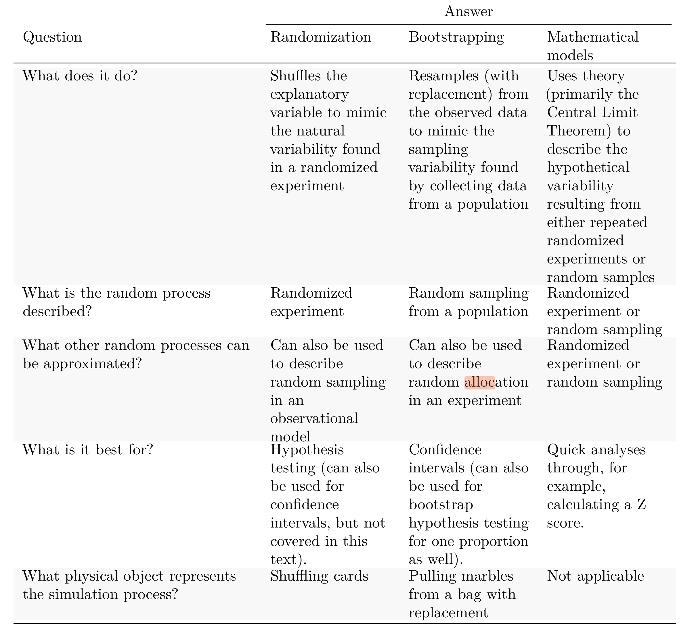

  


  
```{r packages, echo=FALSE, message=FALSE, warning=FALSE}
library(tidyverse)
library(unvotes)
library(knitr)
library(broom)
library(patchwork)
library(ggpubr)
library(scales) # label_dollar 
library(quantreg) # rq
library(kableExtra)
library(openintro)
library(infer)
library(gghighlight)
library(janitor)

hook_output <- knit_hooks$get("output")
knit_hooks$set(output = function(x, options) {
  lines <- options$output.lines
  if (is.null(lines)) {
    return(hook_output(x, options))  # pass to default hook
  }
  x <- unlist(strsplit(x, "\n"))
  more <- "..."
  if (length(lines)==1) {        # first n lines
    if (length(x) > lines) {
      # truncate the output, but add ....
      x <- c(head(x, lines), more)
    }
  } else {
    x <- c(more, x[lines], more)
  }
  # paste these lines together
  x <- paste(c(x, ""), collapse = "\n")
  hook_output(x, options)
})

knitr::opts_chunk$set(comment = NA) # makes it so the ## doesnt appear in output for chunks

source("../_common.R")

library(xaringanthemer)
# style_mono_light(base_color = "#23395b")
style_mono_accent(base_color = "#23395b")

```
Let's summarize what we've described so far.

```{r}
#| echo: false
#| out.width: 60%

```


---
.pull-left[
#### Clarifying definitions

-   **Data distribution** describes the shape, center, and variability of the **observed data**.

-   **Population distribution** describes the shape, center, and variability of the entire **population of data**. Typically not observed.

-   **Sampling distribution** describes the shape, center, and variability of all possible values of a **sample statistic** from samples of a given sample size from a given population. 

    Since the population is never observed, it's never possible to observe the true sampling distribution, but Central Limit Theorem can help.

]

.pull-right[
-   **Randomization distribution** describes the shape, center, and variability of all possible values of a **sample statistic** from random allocations of the treatment variable.  Typically do not know due to computational limitations; often we sample a large number and use this as estimate. Typically describes the null hypothesis.

-   A **bootstrap distribution** describes the shape, center, and variability of all possible values of a **sample statistic** from resamples of the observed data. Typically do not know due to computational limitations; often we sample a large number and use this as estimate. 

    Since bootstrap distributions are generated by randomly resampling from the observed data, they are centered at the sample statistic.
    Often used for constructing confidence intervals.

]

---
.pull-left[
### Case study: Malaria vaccine
* In this study, volunteer patients were randomized into one of two groups
  - 14 patients receive experimental vaccine
  - 6 patients receive placebo vaccine
  - 4 months later, all 20 were exposed to a "drug-sensitive" malaria virus strain (known to be easily treatable)
* Since this is a *randomized experiment*, we might be able to reason that the vaccine *caused* decrease in infection rate
* Results summarized below: 
```{r}
#| label: tbl-malaria-vaccine-20-ex-summary
#| echo: false

malaria |>
  count(treatment, outcome, .drop = FALSE) |>
  pivot_wider(names_from = outcome, values_from = n) |>
  adorn_totals(where = c("row", "col")) |>
  kbl(linesep = "", booktabs = TRUE) |>
  kable_styling(
    bootstrap_options = c("striped", "condensed"),
    latex_options = c("striped", "hold_position"),
    full_width = FALSE
  )
```
]
.pull-right[
* In placebo, 100% got infection; in vaccine, 5/14 = 35.7% got infection
* However, pretty small sample size, need to quantify how likely this is due to random chance
* Let's use a randomization test to see how likely the outcome we saw would be *if vaccine were independent of infection*

  - $H_0$: Independence: vaccination and infection rate are independent
  - $H_A$: Dependence: vaccination and infection rate *are* dependent; since only difference is random assignment to vaccine or placebo, we know vaccine caused lower infection
  
* If null hypothesis is true, then the difference in proportions we saw was just due to random chance. 
]

---

.pull-left[
#### Randomization test
* For randomization test, our starting place is the original observed data: 
```{r}
#| echo: false

malaria |>
  count(treatment, outcome, .drop = FALSE) |>
  pivot_wider(names_from = outcome, values_from = n) |>
  adorn_totals(where = c("row", "col")) |>
  kbl(linesep = "", booktabs = TRUE) |>
  kable_styling(
    bootstrap_options = c("striped", "condensed"),
    latex_options = c("striped", "hold_position"),
    full_width = FALSE
  )
```
* Randomization test: we start by assuming in these 20 patients, 11 were infected and 9 were not infected
* We then repeatedly randomly assign treatment/control to each patient
  - "Shuffle card" idea: 20 cards, 11 labeled "infection", 9 labeled "no infection", then shuffle and split into two decks we call "treatment" (vaccine) and other "control" (placebo)
* Then observe how many in each treatment/control are infected vs not infected
]

.pull-right[
* Output of first randomization (different table format!):

```{r}
#| echo: false
malaria_rand <- tibble(
  response = c(
    rep("infection", 11),
    rep("no infection", 9)
  ),
  outcome = c(
    rep("vaccine", 7), rep("placebo", 4),
    rep("vaccine", 7), rep("placebo", 2)
  )
)

malaria_rand |>
  count(response, outcome, .drop = FALSE) |>
  pivot_wider(names_from = outcome, values_from = n) |>
  adorn_totals(where = c("row", "col")) |>
  kbl(linesep = "", booktabs = TRUE) |>
  kable_styling(
    bootstrap_options = c("striped", "condensed"),
    latex_options = c("striped", "hold_position"),
    full_width = FALSE
  )
```
* Observed difference: 4/6 = 66% of placebo infected, 7/14 = 50% of vaccine infected, difference of 16.7%
* Original data had 6/6 = 100% of placebo infected, 5/14 = 35.7% infected, difference of 64.3% 
* Quite different, but this is just one randomization - need to do many to see how it works out 


]

---
.pull-left[
#### Randomization test
* Original data:


```{r}
#| echo: false

malaria |>
  count(treatment, outcome, .drop = FALSE) |>
  pivot_wider(names_from = outcome, values_from = n) |>
  adorn_totals(where = c("row", "col")) |>
  kbl(linesep = "", booktabs = TRUE) |>
  kable_styling(
    bootstrap_options = c("striped", "condensed"),
    latex_options = c("striped", "hold_position"),
    full_width = FALSE
  )
```

* Output of 100 randomization tests:

```{r}
#| label: fig-malaria-rand-dot-plot
#| echo: false

set.seed(19)
malaria |>
  specify(response = outcome, explanatory = treatment, success = "infection") |>
  hypothesize(null = "independence") |>
  generate(reps = 100, type = "permute") |>
  calculate(stat = "diff in props", order = c("placebo", "vaccine")) |>
  # simplify by rounding
  mutate(stat = round(stat, 3)) |>
  ggplot(aes(x = stat)) +
  geom_dotplot(binwidth = 0.1, dotsize = 0.2) +
  labs(y = NULL, x = "Difference in infection rates") +
  theme(
    axis.title.y = element_blank(),
    axis.text.y = element_blank(),
    axis.ticks.y = element_blank()
  ) +
  gghighlight(stat >= 0.643)
```
]

.pull-right[
* The two highlighted dots are the ones which had a difference of > 64.3%
* So about 2% chance that we would see something as extreme as the difference in the original data
* Note that center is not exactly zero - any idea why?
]

---

.pull-left[
### Inference for proportions
* We'll now focus on a more thorough treatment of inference for proportions
* In this setting, for each observation there is only a single (categorical) variable taking two values, measuring success or failure (e.g. "surgical complication" or "no complication")
* Since there's only a single variable, no way to do a randomization test, so we resort to bootstrapping and mathematical models
* Let's return to the medical consultant example: one consultant tries to attract patients by saying although US average complication rate for surgeries is 10%, only 3 of her 62 clients (4.8%) received them
]

.pull-right[
* As before, no way to actually assess whether her actions cause lower rate of complications (no randomized trial - could selectively choose healthy patients)
* However, we can assess whether $\hat p = 0.048$ would occur due to random chance given population average of $p_0 = 0.10$. 
* Can formulate this as a hypothesis test:
  - $H_0$: no association between consultant contributions and complication rate; $p=0.10$
  - $H_A$: patients with consultant associated with lower complication rate; $p<0.10$ 
* We'll estimate a "p-value": if the null hypothesis is true, what is the probability of observing a test statistic $(\hat p)$ that is as extreme as the one we saw?
]

---

.pull-left[
### Parametric bootstrap simulation
* We want to identify the *sampling distribution* of the test statistic $\hat p$ of proportion of complications under the assumption the null hypothesis is true
* Dataset has 62 observations, 3/62 with complications
* Under null hypothesis, 10% of donors have complications
* Now we want to simulate other datasets of size 62, where with probability 10%, the donor has a complication
* Simulating observations using hypothesized null parameter value = **parametric bootstrap simulation**
* How to simulate?  Imagine a bag of marbles with 10% red marbles and 90% white marbles
* Pull a marble out, if red then complication, if white no complication; return marble and shuffle
* Repeat 62 times for a single bootstrap sample
]

.pull-right[


```{r}
#| include: false
set.seed(334422)
medical_consultant_sim_dist <- tibble(stat = rbinom(10000, 62, 0.1)/62)

medical_consultant_n_sim <- medical_consultant_sim_dist |>
  filter(stat <= 0.0484) |>
  nrow()

medical_consultant_p_val <- round(medical_consultant_n_sim / 10000, 3)
```

```{r}
#| label: fig-nullDistForPHatIfLiverTransplantConsultantIsNotHelpful
#| echo: false
#| out.width: 80%

ggplot(medical_consultant_sim_dist, aes(x = stat)) +
  geom_histogram(binwidth = 0.0167) +
  gghighlight(stat <= 00.0484) +
  scale_x_continuous(breaks = seq(0, 0.25, 0.05), labels = label_number(accuracy = 0.01)) +
  labs(
    x = expression(hat(p)[sim]),
    y = "Number of simulated scenarios"
  )
```
* Above has results of 10,000 simulated studies, proportions $\leq \hat{p} = 0.0484$ are shaded.
* Shaded = sample proportions under null that are as extreme as observed $\hat p$. 
* There were `r medical_consultant_n_sim` simulated sample proportions with $\hat{p}_{sim} \leq 0.0484.$ 
* We use these to construct the null distribution's left-tail area and find the p-value:

$$\text{left area} = \frac{\text{# obs. simulations w/ }\hat{p}_{sim} \leq \text{ 00.0484}}{10000}$$

* Estimated p-value is equal to this tail area: `r medical_consultant_p_val`.
]

---
.pull-left[
* How do you go about simulating this in R?
* When generating a bootstrap sample, we want to calculate **how many succcesses** in $n$ examples where probability of "success" is $p$ for every example, and then divide by $n$
$$ \mathsf{Success}, \mathsf{Success}, \mathsf{Failure}, \mathsf{Success} $$
$$ \longrightarrow \hat p_{sim} = \frac{\text{\# success}}{\text{\# examples}} = \frac{ 3}{4}. $$
* The "distribution" of the number of successes in $n$ trials when each "trial" has probability $p$ of success what is known as the **Binomial(n,p)** distribution. 
* In previous example, in order to create the 10,000 bootstrap samples of proportion of complications under the null of 10% complication rate, we use: 
  - `rbinom(num_samples, num_trials, p_success)`: generates a vector of `num_samples` length, where each component is the outcome of `num_trials` where probability of success in each trial is `p_success`

]

.pull-right[
* Some examples of `rbinom()`:
```{r}
rbinom(10, 5, 0.3)
rbinom(10, 5, 0.3)
rbinom(10, 5, 0.3)
```
* To convert number of successes to proportion, need to normalize by number of trials


```{r}
num_trials <- 62
p_success <- 0.1
num_bootstrap_samples <- 10000
num_successes <- rbinom(
  num_bootstrap_samples,
  num_trials,
  p_success
)
                        
medical_consultant_sim_dist <- tibble(
  stat = num_successes / num_trials)
```
]

---

.pull-left[
#### Mathematical model for a proportion
* When sample size is large enough and sample observations are independent, we can use the normal distribution to describe sampling distribution of sample proportion well


* The sampling distribution for $\hat{p}$ (the sample proportion) based on a sample of size $n$ from a population with a true proportion $p$ is nearly normal when:

1.  The sample's observations are independent, e.g., are from a simple random sample.
1.  We expected to see at least 10 successes and 10 failures in the sample, i.e., $np\geq10$ and $n(1-p)\geq10.$ This is called the **success-failure condition**.

When these conditions are met, then the sampling distribution of $\hat{p}$ is nearly normal with mean $p$ and standard error of $\hat{p}$ as $SE = \sqrt{\frac{\ \hat{p}(1-\hat{p})\ }{n}}.$

]

.pull-right[

* Recall that the margin of error is defined by the standard error.
The margin of error for $\hat{p}$ can be directly obtained from $SE(\hat{p}).$


* The margin of error is $z^\star \times \sqrt{\frac{\ \hat{p}(1-\hat{p})\ }{n}}$ where $z^\star$ is calculated from a specified percentile on the normal distribution.
  - e.g. $z^* = 2$ corresponds to 95% margin of error, $z^*=3$ for 99%

]

---

.pull-left[
### Confidnece intervals for a proportion
* Confidence interval for $p$ takes the form of
$$ \hat p \pm z^* \times SE.$$
* $\hat p$ is sample proportion, and
$$ SE(\hat p) = \sqrt{\frac{p(1-p)}n}.$$
Since $p$ is unknown, we typically use
$$SE(\hat{p}) \approx \sqrt{\frac{(\mbox{best guess of }p)(1 - \mbox{best guess of }p)}{n}}$$
* For hypothesis testing, null $p_0$ is used; for confidence intervals, $\hat p$. 
* $z^*$ is a threshold depending upon level of confidence desired $(z^*=2$: 95% level)
]


.pull-right[
* Example: suppose we have a poll of registered voters (selected at random) of size 300, asking if they support increased taxes for improved 
]

---


.pull-left[
* Example: random sample of 826 payday loan borrowers, assessing interest in regulation for payday loans.  70% of the responders say they support regulations.


1.  Is it reasonable to model the variability of $\hat{p}$ from sample to sample using a normal distribution?

1.  Estimate the standard error of $\hat{p}.$

1.  Construct a 95% confidence interval for $p,$ the proportion of payday borrowers who support increased regulation for payday lenders.

]
.pull-right[

1. Data are a random sample, so reasonable to assume independent observations that represent the population. Need to check success-failure condition.  We don't have $p$, so have to use $\hat p$ to estimate it:
  
$$
\begin{aligned}
  \text{Support: }
      n p &
          \approx 826 \times 0.70
      = 578\\
  \text{Not: }
      n (1 - p) &
        \approx 826 \times (1 - 0.70)
      = 248
\end{aligned}
$$
  Both are >10, so success-failure holds. 
  
2.  Since $p$ is unknown, we use $\hat p$ to estimate the standard error,

$$SE = \sqrt{\frac{p(1-p)}{n}} \approx \sqrt{\frac{0.70 (1 - 0.70)} {826}} = 0.016.$$

3. Using the point estimate 0.70, $z^{\star} = 1.96$ for a 95% confidence interval, and the standard error $SE = 0.016$ from above, 

$$ 
\begin{aligned}
\text{point estimate} \ &\pm \ z^{\star} \times \ SE \\
0.70 \ &\pm \ 1.96 \ \times \ 0.016 \\ 
(0.669 \ &, \ 0.731)
\end{aligned}
$$

]

---
.pull-left[
### Changing the confidence level

* If we want to increase our confidence level, the confidence interval should be LARGER, to account for greater uncertainty; decrease our confidence level, interval should be smaller.
* The 95% conf. interval takes the form 
$$\text{point estimate} \ \pm \ 1.96 \ \times \ SE$$
* 1.96 corresponds to the 95% confidence level
* 2.58 corresponds to 99% confidence level
* Where do these numbers come from? The normal approximation. 

]

.pull-right[

```{r}
#| label: fig-choosingZForCI
#| echo: false
#| out.width: 80%

par(mar = c(3.3, 1, .5, 1), mgp = c(2.1, 0.6, 0))
X <- rev(seq(-4, 4, 0.025))
Y <- dt(X, 10) # makes better visual
plot(X, Y, type = "l", xlab = "standard deviations from the mean", ylab = "", axes = FALSE, xlim = 3.3 * c(-1, 1), ylim = c(0, 0.59), col = IMSCOL["gray", "full"])
axis(1, at = -3:3)
abline(h = 0) 
yMax <- 0.41
X <- seq(-4, 4, 0.025)
Y <- dt(X, 10) # makes better visual
lines(X, Y, col = IMSCOL["gray", "full"])

these <- (X < 2.58 & X > -2.58)
x <- c(-2.58, X[these], 2.58)
y <- c(0, dt(X[these], 10), 0)
polygon(x, y, col = IMSCOL["blue", "f2"], border = "#00000000")
these <- (X < 1.96 & X > -1.96)
x <- c(-1.96, X[these], 1.96)
y <- c(0, dt(X[these], 10), 0)
polygon(x, y, col = IMSCOL["blue", "full"], border = "#00000000")

lines(1.96 * c(-1, 1), rep(yMax, 2), lwd = 2)
lines(rep(-1.96, 2), c(0, yMax), lty = 2, col = IMSCOL["gray", "full"])
lines(rep(1.96, 2), c(0, yMax), lty = 2, col = IMSCOL["gray", "full"])
text(0, yMax, "95%, extends -1.96 to 1.96", pos = 3)

yMax <- 0.53
lines(2.58 * c(-1, 1), rep(yMax, 2), lwd = 2)
lines(rep(-2.58, 2), c(0, yMax), lty = 2, col = "#00000055")
lines(rep(2.58, 2), c(0, yMax), lty = 2, col = "#00000055")
text(0, yMax, "99%, extends -2.58 to 2.58", pos = 3)
```
* We can compute these more exactly using `qnorm`: quantile function
* 99% confidence interval corresponds to 0.5% tail on each side.
* By symmetry, we can just look for the value corresponding to 0.5th percentile.
```{r}
qnorm(0.005) # for 99%
qnorm(0.025) # for 95%
```
]

---
.pull-left[
### Hypothesis test for a proportion
* We use **Z scores** to quickly assess how likely/unlikely the sample proportion differs from a hypothesized proportion.
* It normalizes the observed difference by the standard error (expected variability in the sample proportion) under the null hypothesis.  

$$Z = \frac{\hat{p} - p_0}{\sqrt{p_0(1 - p_0)/n}}$$

* When null hypothesis is true, and when the samples are independent and we have sufficiently many samples,
$$np_0 \geq 10,\ \ n(1-p_0)\geq 10,$$
then $Z$ is approximately a standard normal distribution. 

]

--

.pull-right[
* Example: let's again consider whether payday loan borrowers support regulation on the loans that require evaluating debt payments.  Suppose we have a random sample of 826 borrowers, and 51% said they support regulation.  Is it reasonable to use a normal distribution to model $\hat p$?  What hypothesis should we be testing?
* Independence holds because it's a random sample; and $np_0 = 413$ and $n(1-p_0)=413$ (we are using the null parameter $p_0=0.5$ here).  Thus normal model is applicable.
* $H_0$: not support for regulation, $p\leq 0.5$.
* $H_A$: support for regulation, $p>0.5$. 
* $SE = \sqrt{\frac{p_0(1-p_0)}n} = \sqrt{\frac{0.5(1-0.5)}{826}} = 0.017$. 
]

---

.pull-left[
* Example: let's again consider whether payday loan borrowers support regulation on the loans that require evaluating debt payments.  Suppose we have a random sample of 826 borrowers, and 51% said they support regulation.  Is it reasonable to use a normal distribution to model $\hat p$?  What hypothesis should we be testing?
* Independence holds because it's a random sample; and $np_0 = 413$ and $n(1-p_0)=413$ (we are using the null parameter $p_0=0.5$ here).  Thus normal model is applicable.
* $H_0$: not support for regulation, $p\leq 0.5$.
* $H_A$: support for regulation, $p>0.5$. 
* $SE = \sqrt{\frac{p_0(1-p_0)}n} = \sqrt{\frac{0.5(1-0.5)}{826}} = 0.017$. 
* A picture of the normal model: p-value represented by the shaded region.
]

.pull-right[

```{r}
#| label: fig-normTail-51
#| fig-asp: 0.5
#| echo: false

normTail(0.5, 0.017, U = 0.51, col = IMSCOL["blue", "full"])  
```

* Based on the normal model, the test statistic can be computed as the Z score of the point estimate:

$$
\begin{align}
Z &= \frac{\text{point estimate} - \text{null value}}{SE} \\
  &= \frac{0.51 - 0.50}{0.017} \\
  &= 0.59
\end{align} 
$$

* Tail area which represents the p-value is 0.2776.
* Because the p-value is larger than 0.05, we do not reject $H_0.$ The poll does not provide convincing evidence that a majority of payday loan borrowers support regulations around credit checks and evaluation of debt payments.
]