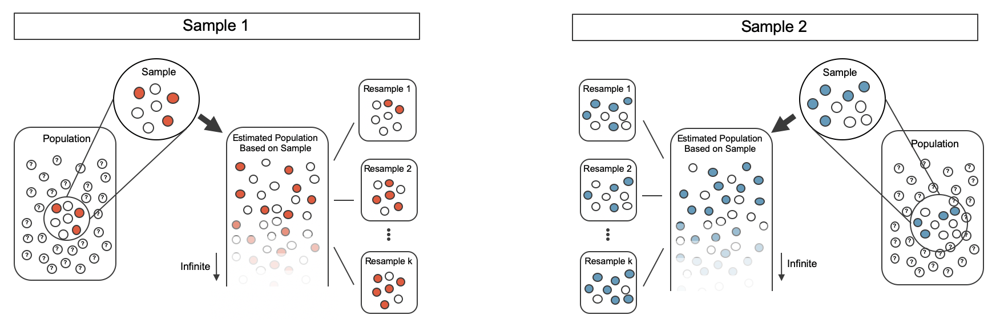
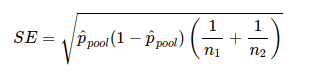
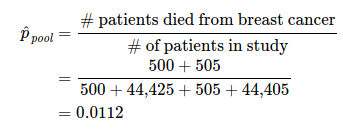

  


  
```{r packages, echo=FALSE, message=FALSE, warning=FALSE}
library(tidyverse)
library(unvotes)
library(knitr)
library(broom)
library(patchwork)
library(ggpubr)
library(scales) # label_dollar 
library(quantreg) # rq
library(kableExtra)
library(openintro)
library(infer)
library(gghighlight)
library(janitor)

hook_output <- knit_hooks$get("output")
knit_hooks$set(output = function(x, options) {
  lines <- options$output.lines
  if (is.null(lines)) {
    return(hook_output(x, options))  # pass to default hook
  }
  x <- unlist(strsplit(x, "\n"))
  more <- "..."
  if (length(lines)==1) {        # first n lines
    if (length(x) > lines) {
      # truncate the output, but add ....
      x <- c(head(x, lines), more)
    }
  } else {
    x <- c(more, x[lines], more)
  }
  # paste these lines together
  x <- paste(c(x, ""), collapse = "\n")
  hook_output(x, options)
})

knitr::opts_chunk$set(comment = NA) # makes it so the ## doesnt appear in output for chunks

source("../_common.R")

library(xaringanthemer)
# style_mono_light(base_color = "#23395b")
style_mono_accent(base_color = "#23395b")
```
.pull-left[
* We will now use similar ideas from previous lectures to derive confidence intervals and hypothesis tests for differences in population proportions from two groups: $p_1 - p_2$.
* For samples of group 1 and group 2, we use point estimate $\hat p_1 - \hat p_2$ to estimate $p_1-p_2$
* To estimate variability / perform inference, we'll use three methods:
  - Randomization test
  - Bootstrap for confidence intervals
  - Normal approximation
]

.pull-right[
* Example dataset: `openintro::cpr`
* Experiment consists of two treatment on patients who underwent CPR for a heart attack and then admitted to a hospital
* Patients randomly assigned to either receive blood thinner (treatment) or not (control)
* Outcome: whether patient survived for >= 24 hours post heart attack
```{r}
str(cpr)
```

```{r}
#| label: tbl-cpr-summary-again
#| echo: false

cpr |>
  mutate(
    outcome = str_to_title(outcome),
    group   = str_to_title(group)
  ) |>
  count(group, outcome) |>
  pivot_wider(names_from = outcome, values_from = n) |>
  janitor::adorn_totals(where = c("row", "col")) |>
  kbl(
    linesep = "", booktabs = TRUE,
    caption = "",
    col.names = c("Group", "Died", "Survived", "Total"),
    align = "lccc"
  ) |>
  kable_styling(
    bootstrap_options = c("striped", "condensed"),
    latex_options = c("striped", "hold_position"),
    full_width = FALSE
  ) |>
  column_spec(1:4, width = "7em")
```

]

---
.pull-left[

```{r}
#| echo: false
cpr |>
  mutate(
    outcome = str_to_title(outcome),
    group   = str_to_title(group)
  ) |>
  count(group, outcome) |>
  pivot_wider(names_from = outcome, values_from = n) |>
  janitor::adorn_totals(where = c("row", "col")) |>
  kbl(
    linesep = "", booktabs = TRUE,
    caption = "",
    col.names = c("Group", "Died", "Survived", "Total"),
    align = "lccc"
  ) |>
  kable_styling(
    bootstrap_options = c("striped", "condensed"),
    latex_options = c("striped", "hold_position"),
    full_width = FALSE
  ) |>
  column_spec(1:4, width = "7em")
```
* Proportion of treatment who survive: $\hat p_T = \frac{14}{30} = 0.35$
* Proportion of control who survive: $\hat p_C = \frac{11}{50} = 0.22$
* Difference $\hat p_T - \hat p_C = 0.13$ - how likely would this occur due to random chance?
* We can formulate a hypothesis test, and a randomization procedure to examine the hypothesis.
  - $H_0$: blood thinners after CPR is independent of survival, $p_1-p_2=0$.
  - $H_A$: blood thinners after CPR increase chance of survival, $p_1-p_2>0$
* Since the assignment of treatment/control was random initially, if we reject the null, we can say the difference we due to usage of blood thinners
]

--

.pull-right[
* We assume same number of people died / survived, then look at what happens if we randomly assign treatment or control to each
* Then calculate proportions within each simulated treatment/control group.
* We plot the difference in 100 randomizations below. 
```{r}
#| label: fig-cpr-rand-dot-plot
#| echo: false
set.seed(47)
cpr |>
  specify(response = outcome, explanatory = group, success = "survived") |>
  hypothesize(null = "independence") |>
  generate(reps = 100, type = "permute") |>
  calculate(stat = "diff in props", order = c("treatment", "control")) |>
  # simplify by rounding
  mutate(stat = round(stat, 3)) |>
  ggplot(aes(x = stat)) +
  geom_dotplot(binwidth = 0.02, dotsize = 0.5) +
  labs(
    y = NULL,
    x = "Difference in randomized survival rates\n(treatment - control)"
  ) +
  theme(
    axis.title.y = element_blank(),
    axis.text.y = element_blank(),
    axis.ticks.y = element_blank()
  ) +
  gghighlight(stat >= 0.13)
```
* 12/100 simulations had a difference of >= 13%
* If null were true, about 12% chance of differences like we saw; this is pretty likely
* Cannot reject null - but just means we don't have enough evidence to suggest blood thinners are effective 

]

---

.pull-left[
#### Bootstrap confidence interval for difference in proportions
* Last slide: randomization distribution to understand distr. of $\hat p_1 - \hat p_2$ under null hypothesis $H_0: p_1-p_2=0$. 
* We previously applied bootstrap sampling to a single population
]

--

.pull-right[
* We now have samples from two different groups, and we will re-sample from each group to calculate bootstrap proportions $\hat p_{1,boot1}, \hat p_{2,boot2}$ from each group.
* We use this to tally up different estimates of the proportions in each bootstrap sample, which gives us an estimate of how much variability there is in the sample proportions (and thus the difference in sample proportions)
]

```{r}
#| out-width: 110%
#| echo: false

```

---

```{r}
#| label: fig-boot2samp1
#| echo: false
#| out.width: 100%
include_graphics("boot2prop1.png")
```

---

.pull-left[
#### Confidence intervals from bootstrap samples
```{r}
#| label: fig-bootCPR1000
#| echo: false
set.seed(47)
cpr_boot_dist <- cpr |>
  specify(response = outcome, explanatory = group, success = "survived") |>
  generate(reps = 1000, type = "bootstrap") |>
  calculate(stat = "diff in props", order = c("treatment", "control"))

ggplot(cpr_boot_dist, aes(x = stat)) +
  geom_histogram(binwidth = 0.05) +
  labs(
    x = "Difference in bootstrapped survival rates\n(treatment - control)",
    y = "Count"
  )
```
* We have already discussed one method for constructing confidence interval: suppose we saved the bootstrap data as
```{r}
head(cpr_boot_dist %>% as_tibble())
```

]

--

.pull-right[ 
* For 95% confidence interval, we want to find the 2.5th and 97.5th percentiles/quantile:
```{r}
quantile(cpr_boot_dist$stat, 0.975)
quantile(cpr_boot_dist$stat, 0.025)
```
* 95% conf interval: (-0.0588, 0.3034) 
  - 95% confidence that in the population, true difference in probability of survival for people receiving blood thinners post CPR is between 0.032 lower and 0.3034 higher
* Similar calculation for 90% conf interval:
```{r}
quantile(cpr_boot_dist$stat, 0.95)
quantile(cpr_boot_dist$stat, 0.05)
```
* 90% conf interval: (-0.029, 0.280)
  - Even at 90% confidence, still includes 0
]

---
.pull-left[
#### Mathematical model for difference in proportions
* Like with $\hat p$ for a single proportion, difference in proportions $\hat p_1 - \hat p_2$ can be modeled with a normal distribution under certain assumptions.
* Assumptions are similar to those from before, but more stringent:
  - **Independence**: data *within each group* and *between groups* are indepednent; generally satisfied if in randomized experiment
  - **Success-failure condition**: at least 10 successes and 10 failure *within each group*
* When these are satisfied, the standard error of $\hat p_1 - \hat p_2$ is

$$SE(\hat{p}_1 - \hat{p}_2) = \sqrt{\frac{p_1(1-p_1)}{n_1} + \frac{p_2(1-p_2)}{n_2}}$$

  where $p_1$ and $p_2$ represent the population proportions, and $n_1$ and $n_2$ represent the sample sizes.
]

--

.pull-right[
* In most cases, the standard error is approximated using the observed data:

$$SE(\hat{p}_1 - \hat{p}_2) = \sqrt{\frac{\hat{p}_1(1-\hat{p}_1)}{n_1} + \frac{\hat{p}_2(1-\hat{p}_2)}{n_2}}$$

  where $\hat{p}_1$ and $\hat{p}_2$ represent the observed sample proportions
* NOTE: $\sqrt{a+b} \neq \sqrt{a} + \sqrt{b}$!  Think of $\sqrt{2 + 2} = \sqrt{4}=2$, but $\sqrt{2} + \sqrt{2} = 2 \sqrt{2} \approx 2.82$. 

* **Margin of error** defined in terms of standard error: 
$$z^\star \times \sqrt{\frac{\hat{p}_1(1-\hat{p}_1)}{n_1} + \frac{\hat{p}_2(1-\hat{p}_2)}{n_2}}$$
  where $z^\star$ is calculated from a specified percentile on the normal distribution (e.g. 1.96 for 95%)
]

---

.pull-left[

* **Margin of error** defined in terms of standard error: 
$$z^\star \times \sqrt{\frac{\hat{p}_1(1-\hat{p}_1)}{n_1} + \frac{\hat{p}_2(1-\hat{p}_2)}{n_2}}$$
  - where $z^\star$ is calculated from a specified percentile on the normal distribution (e.g. 1.96 for 95%)
  - this describes the variability of the difference in proportions (when assumptions for normal model hold)
* Can then use standard approach for defining confidence interval:


$$
\begin{aligned}
\text{point estimate} \ &\pm \  z^{\star} \ \times \ SE \\
(\hat{p}_1 - \hat{p}_2) \ &\pm \ z^{\star} \times \sqrt{\frac{\hat{p}_1(1-\hat{p}_1)}{n_1} + \frac{\hat{p}_2(1-\hat{p}_2)}{n_2}}
\end{aligned}
$$

* Let's return to the CPR dataset

]

--

.pull-left[
```{r}
#| echo: false
cpr |>
  mutate(
    outcome = str_to_title(outcome),
    group   = str_to_title(group)
  ) |>
  count(group, outcome) |>
  pivot_wider(names_from = outcome, values_from = n) |>
  janitor::adorn_totals(where = c("row", "col")) |>
  kbl(
    linesep = "", booktabs = TRUE,
    caption = "",
    col.names = c("Group", "Died", "Survived", "Total"),
    align = "lccc"
  ) |>
  kable_styling(
    bootstrap_options = c("striped", "condensed"),
    latex_options = c("striped", "hold_position"),
    full_width = FALSE
  ) |>
  column_spec(1:4, width = "7em")
```
* Are conditions met?
  - Random assignment of treatment/control, so independence is satisfied
  - Success-failure condition in each group: 11, 14, 39, 26 in each outcome so condition is satisfied - all satisfied
  
* Let's create 90% confidence interval for difference in survival rates. Call $p_T$ for the survival rate in the treatment group and $p_C$ for the control group:

$$\hat{p}_{T} - \hat{p}_{C} = \frac{14}{40} - \frac{11}{50}  = 0.35 - 0.22 = 0.13$$

]

---

.pull-left[
#### Bootstrap confidence interval 

$$\hat{p}_{T} - \hat{p}_{C} = \frac{14}{40} - \frac{11}{50}  = 0.35 - 0.22 = 0.13$$
* Formula for the SE:

$$SE \approx \sqrt{\frac{0.35 (1 - 0.35)}{40} + \frac{0.22 (1 - 0.22)}{50}}  = 0.095$$

* For 90% confidence interval, need to find $z^*$ for this:
```{r}
qnorm(0.05)
```
* $z^* = 1.64$, so

$$
\begin{aligned}
\text{point estimate} \ &\pm \ z^{\star} \ \times \ SE \\
0.13 \ &\pm \ 1.64 \ \times \ 0.095 \\
(-0.027 \ &, \ 0.287)
\end{aligned}
$$
]

--

.pull-right[
* We are 90% confident individuals receiving blood thinners have between a 2.7% fewer chance of survival to 28.7% greater chance of survival
* Since 0% is in the interval, we cannot conclude that blood thinners have an effect on CPR
* Using bootstrap confidence interval estimate, we found 90% confidence interval of (-0.029, 0.280)
* Not exactly the same - we are using simulations for bootstrap, mathematical approximation for above - but roughly similar ideas. 
* Similarly, using randomization test, we found around 12% likelihood that difference we observed in the original dataset (13%) would occur due to random chance if blood thinner treatment is independent of survival. 
]


---

.pull-left[
### Hypothesis test for difference in proportions
* For hypothesis test for *difference in proportions* being not equal (null $H_0$: $p_1-p_2=0$), similar ideas from before: calculate SE and check technical conditions like independence and success-failure
* One difference: success-failure is defined in terms of **pooled proportion**,
$$ \hat p_{pool} = \frac{\text{number successes}}{\text{number cases}} = \frac{\hat p_1 n_1 + \hat p_2 n_2}{n_1 + n_2}. $$
Note that
$$ \hat p_1 = \frac{\text{number successes in sample 1}}{n_1}.$$
* From this we can formulate a test statistic for assessing difference in two proportions - a Z score

]

--

.pull-right[

* Standard error: approximation for the standard deviation of the sampling distribution for $\hat p_1 - \hat p_2$

```{r}
#| echo: false
#| out.width: 80%

```


* General form for Z-score: 

$$ 
\begin{align*}
Z &= \frac{\text{point estimate} - \text{null value}}{SE} \\
&= \frac{\hat p_1 - \hat p_2 - 0}{ \sqrt{\hat p_{pool}(1-\hat p_{pool}) \left( \frac{1}{n_1} + \frac{1}{n_2}\right) }}
\end{align*}
$$
* When null hypothesis is true and following conditions hold, $Z$ has approximately standard normal distribution.
  - Independent observations
  - Sufficiently large samples: $n_1 \hat p_{pool} \geq 10$, $n_1 (1-\hat p_{pool}) \geq 10$, $n_2 \hat p_{pool} \geq 10$, $n_2 (1-\hat p_{pool}) \geq 10$
]

---
.pull-left[
#### Example: mammogram study
* We'll look at data for whether getting mammograms as a part of regular breast cancer exams is effective at reducing death from breast cancer
  - Control: non-mammogram breast cancer exam
  - Treatment mammograms included in breast cancer exam
* Randomly assigned ~90,000 people to each of control/treatment groups
* Data: `mammogram` from openintro package

```{r}
#| label: tbl-mammogramStudySummaryTable
#| echo: false
mammogram |>
  mutate(breast_cancer_death = fct_rev(breast_cancer_death)) |>
  count(treatment, breast_cancer_death) |>
  pivot_wider(names_from = breast_cancer_death, values_from = n) |>
  kbl(
    linesep = "", booktabs = TRUE,
    col.names = c("Treatment", "Yes", "No"),
    format.args = list(big.mark = ",")
  ) |>
  add_header_above(c("", "Death from breast cancer?" = 2)) |>
  kable_styling(
    bootstrap_options = c("striped", "condensed"),
    latex_options = c("striped", "hold_position"), full_width = FALSE
  )
```
]

--

.pull-right[
* We want to test whether mammograms are effective
* Formulate hypotheses:
  - $H_0$: mammograms do not affect survival likelihood
  - $H_A$: mammograms improve likelihood of survival
* Need to check conditions for being able to use Z-score:
  - Independence: random treatment assignment; good
  - Success-failure: need to calculate $\hat p_{pool}$,
  
```{r}
#| echo: false
#| out.width: 80%

```

* This is our best estimate of $p_1$ and $p_2$ *if the null hypothesis is true* that $p_1 = p_2$; we will use this to compute the standard error 

]

---
.pull-left[

```{r}
#| echo: false
mammogram |>
  mutate(breast_cancer_death = fct_rev(breast_cancer_death)) |>
  count(treatment, breast_cancer_death) |>
  pivot_wider(names_from = breast_cancer_death, values_from = n) |>
  kbl(
    linesep = "", booktabs = TRUE,
    col.names = c("Treatment", "Yes", "No"),
    format.args = list(big.mark = ",")
  ) |>
  add_header_above(c("", "Death from breast cancer?" = 2)) |>
  kable_styling(
    bootstrap_options = c("striped", "condensed"),
    latex_options = c("striped", "hold_position"), full_width = FALSE
  )
```
* Calculated before:  $\hat p_{pool} = 0.0112$ 
* Now to check success-failure conditions:
  
$$
\begin{align*}
\hat{p}_{\textit{pool}} \times n_{MGM}
      &= 0.0112 \times \text{44,925} = 503\\
 (1 - \hat{p}_{\textit{pool}}) \times n_{MGM}
      &= 0.9888 \times \text{44,925} = \text{44,422} \\
  \hat{p}_{\textit{pool}} \times n_{C}
      &= 0.0112 \times \text{44,910} = 503\\
  (1 - \hat{p}_{\textit{pool}}) \times n_{C}
      &= 0.9888 \times \text{44,910} = \text{44,407}
\end{align*}
$$
* All are at least 10, so this (plus independence) means we can model the difference of proportions using a normal distribution, and we know that the Z score is approximately standard normal

]

.pull-right[
* To calculate a confidence interval, we need the point estimate as well as the standard error


The breast cancer death rate in the mammogram group was 0.012% less than in the control group.
Next, the standard error is calculated *using the pooled proportion* $\hat{p}_{\textit{pool}}:$


$$\hat{p}_{M} - \hat{p}_{C}= \frac{500}{500 + 44425} - \frac{505}{505 + 44405} = -0.00012$$

$$SE = \sqrt{\frac{\hat{p}_{\textit{pool}}(1-\hat{p}_{\textit{pool}})}{n_{MGM}} + \frac{\hat{p}_{\textit{pool}}(1-\hat{p}_{\textit{pool}})}{n_{C}}}= 0.00070$$

Just like in past tests, we first compute a test statistic and draw a picture:

$$Z = \frac{\text{point est} - \text{null val}}{SE} = \frac{-0.00012 - 0}{0.00070} = -0.17$$

.pull-left[
```{r}
#| echo: false
#| out.width: 100%
#| fig-asp: 0.5
normTail(L = -0.17, U = 0.17, col = IMSCOL["blue", "full"])
```
]
.pull-right[
* Right tail area: 0.4325, via `pnorm(-0.17)`
]


]

---

```{r}
#| echo: false
#| out.width: 75%
#| fig-asp: 0.5
normTail(L = -0.17, U = 0.17, col = IMSCOL["blue", "full"])
```
* Z score: -0.17
* Right tail area: 0.4325, via `pnorm(-0.17)`
* Double to get the p-value: 0.8650
* Can we conclude mammograms have no benefits or do not cause harm?
  - We do not "accept" the null hypothesis 
  - We do not reject the null given the evidence - if mammograms help or hurt, the data suggests the effect is not too large

---
.pull-left[ 
#### Midterm prep: `ggplot`, `dplyr` and functions
* Know and understand the core ggplot functions (and the dplyr basics: `mutate`, `group_by`, `summarize`, ... )
  - `ggplot`, `aes()`, `geom_point()`, `geom_smooth()`, `geom_bar()`, `geom_histogram()`, `geom_boxplot()`, `geom_density()`, `geom_freqpoly()` 
  - `facet_wrap` / `facet_grid`,
  - `labs`,  `guides`, `theme`
* factors, how to relevel them, how to use these in conjunction with ggplot
* functions: general syntax, how default values are used, how to use them, embracing (for use with dplyr), `across()`, 
]

.pull-right[
#### Linear regression
* Slope-intercept / point-slope equations for lines
* Residuals, residual plots, correlation, R^2 (coefficient of determination), SST/SSE
* Understanding outputs of `lm()` in R, translating these into predictions given $x$ values
* Understanding how outliers affect least squares line
* Plotting data from residuals and vice-versa
* Multiple linear regression; categorical variables with 2+ categories; adjusted R^2; model selection with stepwise selection

#### Inference
* Permutation/randomization tests, `sample()`
* Bootstrap samples, bootstrap statistics, bootstrap confidence intervals 
* Z score / normal distribution approximation: `qnorm()`, `pnorm()`, `quantile()`, Z table
* Hypothesis tests, standard error, margin of error
* This for proportions; difference of proportions
]
