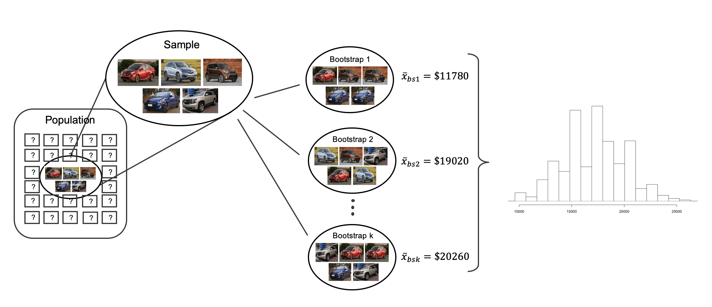

  


  
```{r packages, echo=FALSE, message=FALSE, warning=FALSE}
library(tidyverse)
library(unvotes)
library(knitr)
library(broom)
library(patchwork)
library(ggpubr)
library(scales) # label_dollar 
library(quantreg) # rq
library(kableExtra)
library(openintro)
library(infer)
library(gghighlight)
library(janitor)

hook_output <- knit_hooks$get("output")
knit_hooks$set(output = function(x, options) {
  lines <- options$output.lines
  if (is.null(lines)) {
    return(hook_output(x, options))  # pass to default hook
  }
  x <- unlist(strsplit(x, "\n"))
  more <- "..."
  if (length(lines)==1) {        # first n lines
    if (length(x) > lines) {
      # truncate the output, but add ....
      x <- c(head(x, lines), more)
    }
  } else {
    x <- c(more, x[lines], more)
  }
  # paste these lines together
  x <- paste(c(x, ""), collapse = "\n")
  hook_output(x, options)
})

knitr::opts_chunk$set(comment = NA) # makes it so the ## doesnt appear in output for chunks

source("../_common.R")

library(xaringanthemer)
# style_mono_light(base_color = "#23395b")
style_mono_accent(base_color = "#23395b")
```
.pull-left[
* We will see how to use the bootstrap to develop confidence intervals for a single mean
* We want to know the average price of cars on a lot by taking a random sample
* Suppose we have a sample of five cars, with prices
  - $18,300; $20,100; $9,600; $10,700; $27,000
  - Sample mean: $17,140
  - Standard deviation:
  
  $$
  \begin{align}
  s^2 &= \frac{1}{5-1} \Big( (18300-17140)^2 +\dots \newline \\
  &\quad + (20100-17140)^2 + ... + (27000-17140)^2 \Big) \newline \\
  &\quad\implies s = \$7,170.29
  \end{align}
  $$
  
* How much can we expect the sample mean to change from sample to sample?
]

.pull-right[
* If we don't have the ability to sample more from the population, we can use the bootstrap to estimate this

```{r}
#| label: fig-bootpop1mean
#| echo: false
#| out.width: 100%
include_graphics("bootpop1mean.png")
```

]

---
.pull-left[
* For each bootstrapped re-sample, we get a new subsample that we can calculate a sample mean for
* The variability across sample means across bootstrap re-samples gives us an estimate for the variability of the sample mean from the population

```{r}
#| label: fig-bootmeans1mean
#| echo: false
#| out.width: 200%

```
]

.pull-right[
* Let's suppose we took 1,000 bootstrap samples, and for each bootstrap sample we calculate the sample mean.  It would result in a plot as follows 


```{r}
#| label: fig-carsbsmean
#| echo: false
#| out.width: 100%
aa_cars <- data.frame(price = c(18300, 20100, 9600, 10700, 27000))
set.seed(47)
bscars <- aa_cars |>
  rep_sample_n(size = 5, reps = 1000, replace = TRUE)

bscars_mean <- bscars |>
  group_by(replicate) |>
  summarize(stat = mean(price))

probs <- c(0.005, 0.025, 0.05, 0.1, 0.9, 0.95, 0.975, 0.995)

stat_quantiles <- bscars_mean |>
  pull(stat) |>
  quantile(probs) |>
  as.numeric() |>
  round()

ggplot(bscars_mean, aes(x = stat)) +
  geom_histogram(binwidth = 1500) +
  annotate(
    "segment",
    x = stat_quantiles, xend = stat_quantiles,
    y = rep(0, 8), yend = c(50, 75, 100, 150, 150, 100, 75, 50),
    linetype = "dashed"
  ) +
  annotate(
    "text",
    x = stat_quantiles,
    y = c(50, 75, 100, 150, 150, 100, 75, 50) + 15,
    label = paste0(probs * 100, "th percentile"),
    hjust = c(rep(1, 4), rep(0, 4)), size = 3
  ) +
  annotate(
    "text",
    x = stat_quantiles,
    y = c(50, 75, 100, 150, 150, 100, 75, 50) + 5,
    label = format(stat_quantiles, big.mark = ","),
    hjust = c(rep(1, 4), rep(0, 4)), size = 3
  ) +
  coord_cartesian(xlim = c(8000, 27000)) +
  labs(
    x = "Bootstrapped mean of car prices from Awesome Auto",
    y = "Count",
    title = "1,000 bootstrapped means"
  )
```
* To develop bootstrap confidence interval for the population mean at e.g. 90% confidence level, we can simply calculate the values corresponding to the 5% and 95% percentile of the bootstrapped statistics
]

---

.pull-left[
#### Computing bootstrap means and confidence intervals
* Let's build a function which takes in a sample (a vector of numerics), and then computes a desired number of bootstrap re-samples and returns the sample means for each bootstrap re-sample.
```{r}
bootstrap_samp_means <- function(observations, num_resample = 500) {
  means <- numeric(num_resample)
  num_observations <- length(observations)
  for(i in 1:num_resample) {
    resampled <- sample(observations, size = num_observations, replace = TRUE)
    means[i] <- mean(resampled, na.rm=TRUE)
  }
  return(means)
}
```

]

.pull-right[
* For the car example, here's how we could do this:
```{r}
obs <- c(18300, 20100, 9600, 10700, 27000)
bs_means <- bootstrap_samp_means(obs, num_resample = 500)
mean(obs)
bs_means[1:5]
```
* If we want to construct a 90% confidence interval, want to find 5th percentile and 95th percentile
```{r}
(qs <- quantile(bs_means, probs = c(0.05, 0.95)))
```
* We are 90% confident true average is between $`r formatC(as.numeric(qs[1]), format="f", digits=0)` and $`r formatC(as.numeric(qs[2]), format='f', digits=0)`
* We can also see variability across bootstrap samples:
```{r}
quantile(bootstrap_samp_means(obs, num_resample = 100), probs = c(0.05, 0.95))
```


]

---
.pull-left[
#### Bootstrap percentile confidence interval for a standard deviation
* We have thus far focused on trying to understand the **mean** or average of a population
* We are also often interested in the standard deviation $\sigma$ of the variable - this represents the natural variability of the population value $\mu$
* We have constructed point estimate using samples via

$$ s^2 = \frac{1}{n-1} \sum_{i=1}^n (x_i - \bar x)^2 $$
* Then we have that $s^2$ is a good approximation for $\sigma^2$
* If we want to construct a *confidence interval* for $\sigma$, then we can use bootstrap idea as before.
]

--

.pull-right[
* Recall for constructing confidence interval for population mean using bootstrap:
  - Take bootstrap re-samples of dataset
  - Compute **sample mean** for each bootstrap sample
  - Create histogram of **sample means** across each bootstrap sample
  - Use the percentiles of the histogram to get confidence intervals
* Same idea for confidence intervals for population variance $\sigma^2$ / s.d. $\sigma$:
  - Take bootstrap re-samples of dataset
  - Compute **sample variance $s^2$** for each bootstrap sample
  - Create histogram of **sample variances** across each bootstrap sample
  - Use the percentiles of the histogram to get confidence intervals
]

---

.pull-left[
* Results of bootstrap *standard deviations*: 
```{r}
#| label: fig-carsbssd
#| out-width: 100%
#| echo: false
bscars_sd <- bscars |>
  group_by(replicate) |>
  summarize(stat = sd(price))

probs <- c(0.005, 0.025, 0.05, 0.1, 0.9, 0.95, 0.975, 0.995)

stat_quantiles <- bscars_sd |>
  pull(stat) |>
  quantile(probs) |>
  as.numeric() |>
  round()

ggplot(bscars_sd, aes(x = stat)) +
  geom_histogram(binwidth = 500) +
  annotate(
    "segment",
    x = stat_quantiles, xend = stat_quantiles,
    y = rep(0, 8), yend = c(50, 75, 100, 150, 150, 100, 75, 50),
    linetype = "dashed"
  ) +
  annotate(
    "text",
    x = stat_quantiles,
    y = c(50, 75, 100, 150, 150, 100, 75, 50) + 15,
    label = paste0(probs * 100, "th percentile"),
    hjust = c(rep(1, 4), rep(0, 4)), size = 3
  ) +
  annotate(
    "text",
    x = stat_quantiles,
    y = c(50, 75, 100, 150, 150, 100, 75, 50) + 5,
    label = format(stat_quantiles, big.mark = ","),
    hjust = c(rep(1, 4), rep(0, 4)), size = 3
  ) +
  coord_cartesian(clip = "off", xlim = c(-1200, 11500)) +
  labs(
    x = "Bootstrapped standard deviation of\ncar prices from Awesome Auto",
    y = "Count",
    title = "1,000 bootstrapped standard deviations"
  )
```
* Very high variability
* This is due to the very small sample size - only 5 observations
* As we increase the original dataset sample size, the bootstrap gets better
* Precise characterization of how sample size / number bootstrap trials affect the accuracy of the bootstrap is beyond this course -- subject of current research
]

--

.pull-right[
#### Mathematical model for a mean
* Recall that we previously used Central Limit Theorem to show that the variability of sample proportion is well-described by normal distribution
* For proportions, the single parameter $p\in [0,1]$ determines the variance $p(1-p)$ (and thus s.d. $\sqrt{p(1-p)}$) 
* Thus the only source of uncertainty is in measuring $p$
* For numerical variables, there are two sources of uncertainty:
  - The average/mean $\mu$ - typical value
  - The standard deviation $\sigma$ - typical variability in the parameter
* Thus we need a slightly different approach
]

---
.pull-left[
#### Mathematical model for a mean
* Central Limit Theorem for the sample mean:
  - If sufficiently large number of $n$ independent samples from population with mean $\mu$, s.d. $\sigma$, then:
  - Sampling distribution of $\bar x_n$ is $\approx N(\mu, \sigma / \sqrt n)$ - approximately normal with mean $\mu$ and standard deviation $\sigma/\sqrt n$. 
  - However, generally do not know population-level $\sigma$ - we have to estimate $\sigma$
  - When you have to estimate $\sigma$, the sampling distribution of $\bar x_n$ is not approximately normal, but is what's called a "t distribution"
]

--

.pull-right[
* The $t$ distribution is defined in terms of **degrees of freedom** `df`. 
* Has a similar bell-shaped curve to normal, but has "thicker tails" -- allows for more extreme events to occur than normal


```{r}
#| label: fig-tDistCompareToNormalDist
#| echo: false
#| warning: false
#| message: false
#| fig-asp: 0.5
#| out.width: 90%
df <- tibble(
  x = rep(seq(-5, 5, 0.01), 2),
  distribution = c(rep("Normal distribution", 1001), rep("t-distribution", 1001))
) |>
  mutate(y = if_else(distribution == "Normal distribution", dnorm(x), dt(x, df = 1)))

ggplot(df, aes(x = x, y = y, color = distribution, linetype = distribution, size = distribution)) +
  geom_hline(yintercept = 0) +
  geom_line() +
  scale_color_manual(values = c(IMSCOL["blue", "full"], IMSCOL["red", "full"])) +
  scale_linetype_manual(values = c("dashed", "solid")) +
  scale_size_manual(values = c(0.5, 1)) +
  theme(
    # axis.text = element_blank(),
    panel.grid.major = element_blank(),
    panel.grid.minor = element_blank(),
    legend.position = c(0.2, 0.7),
    legend.background = element_rect(fill = "white", color = NA),
    legend.text = element_text(size = 12)
  ) +
  labs(x = NULL, y = NULL, color = NULL, linetype = NULL, size = NULL)
```
* This shows $t$ distribution with 1 d.o.f.
* For normal, very little data beyond 2.5, while for t distribution, relatively more 
]

---

.pull-left[
* When looking at a dataset with $n$ samples, we will typically use the $t$ distribution with $n-1$ degrees of freedom
* As degrees of freedom increases, the $t$ distribution gets thinner tails and looks more like a standard normal 
* When d.o.f. $>30$, almost indistinguishable from standard normal 
* Intuition: height/thickness represents how likely values are; when d.o.f. ($n-1$) is small, we are more uncertain and so more extreme values are more likely

```{r}
#| label: fig-tDistConvergeToNormalDist
#| echo: false
#| warning: false
#| message: false

plot(c(-5, 5),
  c(0, dnorm(0)),
  type = "n", ylab = "", xlab = "",
  axes = FALSE
)
at <- seq(-10, 10, 2)
axis(1, at)
axis(1, at - 1, rep("", length(at)), tcl = -0.1)
abline(h = 0)

COL. <- fadeColor(IMSCOL["blue", "full"], c("FF", "89", "68", "4C", "33"))
COLt <- fadeColor(IMSCOL["blue", "full"], c("FF", "AA", "85", "60", "45"))
DF <- c("normal", 8, 4, 2, 1)

X <- seq(-10, 10, 0.02)
Y <- dnorm(X)
lines(X, Y, col = COL.[1])

for (i in 2:5) {
  Y <- dt(X, as.numeric(DF[i]))
  lines(X, Y, col = COL.[i], lwd = 1.5)
}

legend(2.5, 0.4,
  legend = c(
    DF[1],
    paste("t, df = ", DF[2:5], sep = "")
  ),
  col = COL.,
  text.col = COLt,
  lty = rep(1, 5),
  lwd = 1.5
)
```

]

.pull-right[
* Recall in R, to calculate probabilities under normal, we used 
  - `pnorm(val, mean, sd)` to calculate probability that $N(\mu, \sigma)$ is $<= \text{val}$
  - `qnorm(quantile, mean, sd)` to calculate value corresponding to `quantile`
* Similarly, for $t$-distribution, we use
  - `pt(val, df)` to calculate probability that $t$ distr. with `df` degrees of freedom is $<= \text{val}$
  - `qt(quantile, df)` to calculate value corresponding to `quantile` for $t$ distr. with `df` degrees of freedom 
  
```{r, echo=FALSE}
pnorms <- tibble(val = seq(-3, 3, 1)) %>%
  mutate(pnorm = pnorm(val),
         pt_2 = pt(val, df = 2),
         pt_5 = pt(val, df = 5),
         pt_30 = pt(val, df = 30))
qnorms <- tibble(quantiles = c(0.05, 0.25, 0.5, 0.75, 0.95)) %>%
  mutate(qnorm = qnorm(quantiles),
         qt_2 = qt(quantiles, df = 2),
         qt_5 = qt(quantiles, df = 5),
         qt_30 = qt(quantiles, df = 30))
```
```{r}
pnorms
```


]

---

.pull-left[
### $t$ distribution calculations
* Probability that $t$ distribution with 20 degrees of freedom is less than -1.5?

```{r}
#| echo: true
# use pt() to find probability under the $t$-distribution
pt(-1.5, df = 18)
```

```{r}
#| label: fig-tDistDF18LeftTail2Point10
#| echo: false
#| fig-asp: 0.5
#| out-width: 100%
normTail(
  L = -1.5,
  df = 18,
  xlim = c(-4, 4),
  col = IMSCOL["blue", "full"],
  axes = FALSE
)
axis(1)
```
]

.pull-right[

* Probability that $t$ distribution with 11 degrees of freedom is bigger than 2.5?
```{r}
1 - pt(2.5, df = 11)
```


```{r}
#| echo: false
#| fig-asp: 0.5
#| out-width: 80%
normTail(
  U = 2.5,
  df = 11,
  xlim = c(-4, 4),
  col = IMSCOL["blue", "full"],
  axes = FALSE
)
axis(1)
```

]

---
.pull-left[
* Probability that $t$ distribution with 2 degrees of freedom is more than 3 units away from the mean?

```{r}
#| echo: true
# use pt() to find probability under the $t$-distribution
pt(-3, df = 2) + (1 - pt(3, df = 2))
```

```{r}
#| label: fig-tDistDF23UnitsFromMean
#| echo: false
#| out-width: 80%
normTail(
  L = -3,
  U = 3,
  df = 2,
  xlim = c(-4.5, 4.5),
  col = IMSCOL["blue", "full"]
)
```
* $t$ distribution is symmetric around 0, so could also do
```{r}
2*pt(-3, df = 2)
```

]

--
.pull-right[
* Compare with what happens with standard normal: 68-95-99.7 rule says that only 0.3% (=0.003) would be more than 3 units from the mean.
* Since $t$ distribution has fatter tails, it assigns greater probability to extreme values, so we get significantly more area for $t$ distribution. 
* As degrees of freedom increase, this becomes less and less the case. 
]

---
### Conditions needed for using $t$-distr. confidence intervals
* Previously: *if* we have independent samples and sufficiently large dataset where population has mean $\mu$ and s.d. $\sigma$, then $\bar x_n$ is approximately normal, with mean $\mu$ and s.d. $\sigma/\sqrt n$. 
* However, we don't know $\sigma$, and if we want to use the sample estimate $s$ for $\sigma$ then we can't say that $\bar x_n$ is approximately normal, but will instead be $t$ distribution with $n-1$ d.o.f. under certain conditions
* Conditions needed:
  - Independent sample observations (satisfied w/ random sample)
  - Normality of samples - each $x_i$ is from a normal distribution (or approximately).  How to check?
    * If $n<30$ and no clear outliers, then OK.
    * If $n\geq 30$ and no particularly *extreme* outliers, then OK
* If these assumptions hold, then the confidence interval for the mean is

```{r}
#| echo: false
#| out.width: 25%

```
* $t^*_{df}$ found same way as for $z^*$: $t^*_{df}$ is s.t. the proportion of $t$ distr with $df$ d.o.f. within a distance $t^*_{df}$ of 0 matches confidence level of interest 

---
.pull-left[ 
### One sample t-intervals

```{r}
#| echo: false
#| out.width: 50%

```


* $t^*_{df}$ found same way as for $z^*$: $t^*_{df}$ is s.t. the proportion of $t$ distr with $df$ d.o.f. within a distance $t^*_{df}$ of 0 matches confidence level
* Recall if we wanted to find $z^*$ corresponding to 95% confidence level, we could calculate
  - `qnorm(1 - 0.05/2) = qnorm(0.97.5)` $= 1.95 \approx 2$

```{r}
#| echo: false
#| out-width: 65%
normTail(
  L = -1.95,
  U = 1.95,
  xlim = c(-4.5, 4.5),
  col = IMSCOL["blue", "full"]
)
```
]

--

.pull-right[
* Same idea holds for finding $t^*_{df}$: to get confidence level of $1-\alpha$, we use
  - `qt(1 - alpha/2, df = df)`
* E.g. if d.o.f. = 5 and we want 95% confidence level,
```{r}
qt(1 - 0.05/2, df = 5)
```

```{r}
#| echo: false
#| out-width: 75%
normTail(
  L = -2.57,
  U = 2.57,
  df = 5,
  xlim = c(-4.5, 4.5),
  col = IMSCOL["blue", "full"]
)
```
]

---
.pull-left[
#### Example: mercury in tuna
* Let's consider problem of measuring the amount of mercury in tuna
* High mercury concentrations can be dangerous for the tuna and humans that eat them
* Suppose we have a random sample of 19 tunas, with measurements as follows; measurements in micrograms mercury / gram tuna

```{r}
#| label: tbl-summaryStatsOfHgInMuscleOfRissosDolphins
#| echo: false
dolphin_summary_stats <- tribble(
  ~n, ~Mean, ~SD, ~Min, ~Max,
  19, 4.4, 2.3, 1.7, 9.2
)

dolphin_summary_stats |>
  kbl(
    linesep = "", booktabs = TRUE,
    align = "ccccc"
  ) |>
  kable_styling(
    bootstrap_options = c("striped", "condensed"),
    latex_options = c("striped", "hold_position"), full_width = FALSE
  ) |>
  column_spec(1:5, width = "6em")
```
* Conditions for applying $t$ distr. satisfied?   
  - Independent since random sample
  - $n<30$ and summary stats suggest no clear outliers.
  - All good
]

--

.pull-right[
* Let's calculate 95% confidence interval
* Calculate standard error:
$$ SE = \frac{s}{\sqrt n} = \frac{2.3}{\sqrt{19}} = 0.528$$
* Since d.o.f. is $n-1=19-1$, calculate $t^*_{19-1}$ for $1-0.05$ confidence level:
```{r}
qt(1-0.05/2, df = 18)
```
* Thus 95% confidence interval is 

$$
\begin{aligned}
\bar{x} \ &\pm\  t^{\star}_{18} \times SE \newline \\
4.4 \ &\pm\  2.10 \times 0.528 \newline \\
(3.29 \  &, \ 5.51)
\end{aligned} 
$$
* We are 95% confident that average mercury content in tunas is between 3.29 and 5.51 micrograms per gram of tuna - very high. 
]

---

.pull-left[
#### One sample $t$-tests 
* We now know how to calculate a $t$-distribution based confidence interval
* Let's look now at hypothesis tests for the mean
* **T score** is a ratio of how the sample mean differs from the hypothesized mean as compared to how the observations vary.

$$ T = \frac{\bar{x} - \mbox{null value}}{s/\sqrt{n}} $$

* When the null hypothesis is true and the conditions are met, T has a t-distribution with $df = n - 1.$ Conditions:
  -   Independent observations.
  -   Large samples and no extreme outliers.
]

--

.pull-right[
* Example: testing whether runners in Washington, DC races are getting slower or faster over time
* In 2006, DC Cherry Blossom Race (10 miles) had average of 93.29 minutes
* Will use data from 100 participants from 2017 to determine whether runners are getting faster or slower (vs. possiblity of no change)
  - Null hypothesis $H_0$: average 10 mile time is same in 2006 as in 2017, so $\mu = 93.29$
  - Alternative hypothesis $H_A$: average 10 mile run time is different in 2017; $\mu \neq 93.29$
* Data looks like:

```{r}
#| out.width: 60%
#| echo: false
set.seed(1)

run17_sample_100 <- run17 |>
  filter(event == "10 Mile") |>
  sample_n(size = 100) |>
  mutate(time = net_sec / 60)

run17_sample_100_time_mean <- round(mean(run17_sample_100$time), 2)
run17_sample_100_time_sd <- round(sd(run17_sample_100$time), 2)
run17_sample_100_time_n <- nrow(run17_sample_100)

ggplot(run17_sample_100, aes(x = time)) +
  geom_histogram(binwidth = 5) +
  labs(x = "Time (minutes)", y = "Count")
```
* Large enough samples, no extreme outliers, can proceed 
]

---
.pull-left[
* To do the hypothesis test, same procedure as before
  - Normal setting: find Z-score using observed value, null value, standard error, then use normal distribution to calculate tail area / p value
  - This setting: T-score using observed value, null value, standard error, then use **t distribution** to calculate tail area / p value
* For sample of 100 runners, 2017 data had average of 98.78 and s.d. of 16.59; average run time in 2006 was 93.29
* First calculate standard error:

$$ SE = \frac{s}{\sqrt{n}} = \frac{16.59}{\sqrt{100}} = 1.66$$

* T score:

$$ T = \frac{\text{observed}-\text{null}}{SE} = \frac{98.8 - 93.29}{1.66} = 3.32$$
]

--

.pull-right[
* We have $n=100$ observations, so $df=100-1=99$.
```{r}
#| echo: false
#| out-width: 75%
normTail(
  U = 3.32,
  df = 99,
  xlim = c(-4.5, 4.5),
  col = IMSCOL["blue", "full"]
)
```
* We can use `pt` to find this; by symmetry, area to right of 3.32 is same as area to left of -3.32, so
```{r}
pt(-3.32, df = 99)
```
* Double this to get the p-value - 0.00126. 
* Since $p$-value is $<0.05$, we can reject the null hypothesis at 95% confidence level.
  - Can reject at even 99% confidence level. 
  - Thus average run time in 2017 is different than 2006. 
]