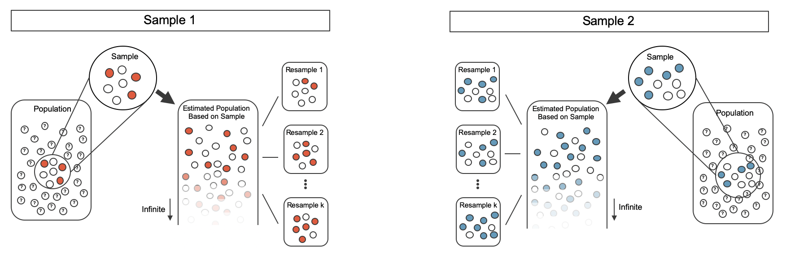

  


  
```{r packages, echo=FALSE, message=FALSE, warning=FALSE}
library(tidyverse)
library(unvotes)
library(knitr)
library(broom)
library(patchwork)
library(ggpubr)
library(scales) # label_dollar 
library(quantreg) # rq
library(kableExtra)
library(openintro)
library(infer)
library(gghighlight)
library(janitor)

hook_output <- knit_hooks$get("output")
knit_hooks$set(output = function(x, options) {
  lines <- options$output.lines
  if (is.null(lines)) {
    return(hook_output(x, options))  # pass to default hook
  }
  x <- unlist(strsplit(x, "\n"))
  more <- "..."
  if (length(lines)==1) {        # first n lines
    if (length(x) > lines) {
      # truncate the output, but add ....
      x <- c(head(x, lines), more)
    }
  } else {
    x <- c(more, x[lines], more)
  }
  # paste these lines together
  x <- paste(c(x, ""), collapse = "\n")
  hook_output(x, options)
})

knitr::opts_chunk$set(comment = NA) # makes it so the ## doesnt appear in output for chunks

source("../_common.R")

library(xaringanthemer)
# style_mono_light(base_color = "#23395b")
style_mono_accent(base_color = "#23395b")
```
.pull-left[

* We saw last class how to use the bootstrap to develop confidence intervals and hypothesis tests for a single mean $\mu$ - e.g. we want to understand a single numeric value about a population (height, speed, etc)
* We'll now see how to develop confidence intervals and hypothesis tests for the *difference* of two means, $\mu_1 - \mu_2$; mean of two different populations (e.g. average height of Americans vs. Canadians)
  - Point estimate for single mean: $\bar x$
  - Point estimate for difference $\mu_1-\mu_2$: $\bar x_1 - \bar x_2$, where $\bar x_i$ is sample mean from population $i$
* Many of the ideas we explored for understanding two proportions will carry over
  - Randomization tests
  - Bootstrap for difference of means
  - Mathematical approach (Central Limit)
]

--

.pull-right[
* Examples of settings where we may want to understand difference of means in two populations:
  - Seeing whether pregnant women who are smokers vs. non-smokers have differences in baby weight
  - Examining whether there is significant evidence that one exam was harder than another
  - Seeing whether Americans or Canadians have different heights
]

---

.pull-left[
### Randomization test for difference in means

* An instructor decided to run two slight variations of the same exam.
* Prior to passing out the exams, they shuffled the exams together to ensure each student received a random version.
* Anticipating complaints from students who took Version B, they would like to evaluate whether the difference observed in the groups is so large that it provides convincing evidence that Version B was more difficult (on average) than Version A.

Summary statistics for how students performed on these two exams are shown below.

```{r}
#| label: tbl-summaryStatsForTwoVersionsOfExams
#| echo: false
classdata <- classdata |>
  filter(lecture %in% c("a", "b")) |>
  mutate(
    lecture = str_to_upper(lecture),
    exam = lecture
  )

classdata |>
  group_by(exam) |>
  summarise(
    n = n(),
    mean = mean(m1),
    sd = sd(m1),
    min = min(m1),
    max = max(m1)
  ) |>
  kbl(
    linesep = "", booktabs = TRUE,
    col.names = c("Group", "n", "Mean", "SD", "Min", "Max"),
    align = "ccccc"
  ) |>
  kable_styling(
    bootstrap_options = c("striped", "condensed"),
    latex_options = c("striped", "hold_position"), full_width = FALSE
  ) |>
  column_spec(1:5, width = "5em")
```

]

--

.pull-right[

```{r}
#| label: fig-boxplotTwoVersionsOfExams
#| echo: false
ggplot(classdata, aes(x = exam, y = m1, color = exam)) +
  geom_boxplot(show.legend = FALSE) +
  geom_jitter(width = 0.1) +
  labs(title = "Boxplot of exam score broken down by version of exam", x = "Exam", y = "Score") +
  scale_color_manual(values = c(IMSCOL["blue", "full"], IMSCOL["red", "full"]))
```
* Hypotheses to evaluate whether observed difference in sample means is likely to have happened due to chance:
  - $H_0$: exams are equally difficult on average; $\mu_A - \mu_B=0$.
  - $H_A$: one exam is more difficult than other; $\mu_A - \mu_B \neq 0$
* Observations regarding the setup:
  - Independence *within* each group and *between* groups since exams shuffled and randomly passed out
  - min/max values suggest no outliers 
]

---
.pull-left[
#### Variability of the statistic
* Previously: variability of difference in proportions $\hat p_1 - \hat p_2$ estimated by randomly assigning treatment to each observation
* Here we do similarly: we take all exam scores and then randomly assign whether they are in group A or group B, then look at what the difference $\bar x_{A,sim1} - \bar x_{B,sim1}$ is
* We are simulating the null hypothesis, which is that $\mu_A=\mu_B$, so treating each person as group A or group B doesn't matter

```{r}
#| label: fig-rand2means
#| warning: false
#| out-width: 95%
#| echo: false
include_graphics("rand2means.png")
```
]
--
.pull-right[
* When we repeat this 1,000 times, we get an estimate of what the natural variability in $\bar x_A - \bar x_B$ is when there is no actual dependence between group and score on the exam.

```{r}
#| label: fig-randexamspval
#| echo: false

stat_2means <- classdata |>
  specify(m1 ~ exam) |>
  calculate(stat = "diff in means", order = c("A", "B"))

set.seed(47)
classdata |>
  specify(m1 ~ exam) |>
  hypothesize(null = "independence") |>
  generate(reps = 1000, type = "permute") |>
  calculate(stat = "diff in means", order = c("A", "B")) |>
  visualize() +
  labs(
    title = "1,000 differences in randomized means",
    x = "Difference in randomized means\n(A - B)",
    y = "Count"
  ) +
  shade_p_value(obs_stat = stat_2means, direction = "two-sided", color = IMSCOL["red", "full"])
```
* In the actual data we got, we have sample mean of 75.1 in group A, 72.0 in group B, difference of 3.1 - highlighted above. 
* We see that $\approx 60+25 = 85$ out of 1,000 bootstrap trials result in difference greater than 3.1, similarly around 85/1,000 result in negative difference of more than -3.1 
]

---

.pull-left[
```{r}
#| echo: false

stat_2means <- classdata |>
  specify(m1 ~ exam) |>
  calculate(stat = "diff in means", order = c("A", "B"))

set.seed(47)
classdata |>
  specify(m1 ~ exam) |>
  hypothesize(null = "independence") |>
  generate(reps = 1000, type = "permute") |>
  calculate(stat = "diff in means", order = c("A", "B")) |>
  visualize() +
  labs(
    title = "1,000 differences in randomized means",
    x = "Difference in randomized means\n(A - B)",
    y = "Count"
  ) +
  shade_p_value(obs_stat = stat_2means, direction = "two-sided", color = IMSCOL["red", "full"])
```
* In the actual data we got, we have sample mean of 75.1 in group A, 72.0 in group B, difference of 3.1 - highlighted above. 
* We see that $\approx 60+25 = 85$ out of 1,000 bootstrap trials result in difference greater than 3.1, similarly around 85/1,000 result in negative difference of more than -3.1 
]

--

.pull-right[
* We therefore get a p-value of approximately $0.17 = 2*85/1,000$.  
* If we used an $\alpha = 0.05$ threshold, we would not be able to reject the null hypothesis
* Put another way: the type of difference in the performance on these exams that we saw was fairly likely to occur due to random chance.
]

---

.pull-left[
#### Bootstrap confidence interval for difference in means
* Let's refresh how we did bootstrap confidence interval for difference in *proportions* 
]


.pull-right[
* We now have samples from two different groups, and we will re-sample from each group to calculate bootstrap proportions $\hat p_{1,boot1}, \hat p_{2,boot2}$ from each group.
* We use this to tally up different estimates of the proportions in each bootstrap sample, which gives us an estimate of how much variability there is in the sample proportions (and thus the difference in sample proportions)
]

```{r}
#| out-width: 110%
#| echo: false

```

---

.pull-left[
#### Bootstrap confidence interval for difference in means
* Let's now think of a setting where we have two random samples from different groups with a numeric variable of interest
* E.g. assessing 2 car lots, seeing which one has a cheaper average, using a sample from each

]

.pull-right[
* We take *bootstrap samples* from **each** group
* then calculate sample means in each bootstrap sample, $\bar x_{1, boot1}$ and $\bar x_{2, boot2}$,
* then use these to calculate estimated difference in means $\bar x_{1,boot1} - \bar x_{2, boot2}$
]

```{r}
#| label: fig-bootmeans2means
#| out-width: 70% 
#| echo: false
include_graphics("bootmeans2means.png")
```

---

.pull-left[
#### Case study
* Consider the following experiment that seeks to examine whether using embryonic stem cells (ESC) help improve heart function following a heart attack
* In experiment, people are randomly assigned to treatment (ESC) and control groups, and then heart pumping capacity was measured in a study
* We want to identify 95% confidence interval for effect of ESC on change in heart pumping capacity
* Summary statistics from experiment:

```{r}
#| label: tbl-statsSheepEscStudy
#| echo: false

stem_cell <- openintro::stem_cell |>
  mutate(
    trmt = if_else(trmt == "ctrl", "Control", "ESC"),
    trmt = fct_relevel(trmt, "ESC", "Control"),
    change = after - before
  )

stem_cell |>
  group_by(trmt) |>
  summarise(
    n = n(),
    mean = mean(change),
    sd = sd(change)
  ) |>
  kbl(
    linesep = "", booktabs = TRUE,
    col.names = c("Group", "n", "Mean", "SD"),
    digits = 2, align = "lccc"
  ) |>
  kable_styling(
    bootstrap_options = c("striped", "condensed"),
    latex_options = c("striped", "hold_position"), full_width = FALSE
  ) |>
  column_spec(1:4, width = "6em")
```
]

--
.pull-right[
* Point estimate of the difference in heart pumping:  difference in the sample means.

$$\bar{x}_{esc} - \bar{x}_{control}\   =\ 3.50 - (-4.33)\   =\ 7.83$$

* We now want to use bootstrap to estimate the variability of difference in sample means when taking repeated samples
* We take bootstrap samples (sample with replacement) within each group, then use this to compute a bootstrap-estimated difference in sample means

$$\bar x_{esc,i} - \bar x_{control,i}$$

* This produces a bootstrap distribution of sample means 
]

---

.pull-left[

* Summary statistics from data:
```{r}
#| echo: false

stem_cell <- openintro::stem_cell |>
  mutate(
    trmt = if_else(trmt == "ctrl", "Control", "ESC"),
    trmt = fct_relevel(trmt, "ESC", "Control"),
    change = after - before
  )

stem_cell |>
  group_by(trmt) |>
  summarise(
    n = n(),
    mean = mean(change),
    sd = sd(change)
  ) |>
  kbl(
    linesep = "", booktabs = TRUE,
    col.names = c("Group", "n", "Mean", "SD"),
    digits = 2, align = "lccc"
  ) |>
  kable_styling(
    bootstrap_options = c("striped", "condensed"),
    latex_options = c("striped", "hold_position"), full_width = FALSE
  ) |>
  column_spec(1:4, width = "6em")
```

* Results of 1,000 bootstrap trials: 
```{r}
#| label: fig-bootexamsci
#| echo: false
#| warning: false
set.seed(470)

boot_2mean <- stem_cell |>
  specify(change ~ trmt) |>
  generate(reps = 1000, type = "bootstrap") |>
  calculate(stat = "diff in means", order = c("ESC", "Control"))

stat_2means <- stem_cell |>
  specify(change ~ trmt) |>
  calculate(stat = "diff in means", order = c("ESC", "Control"))


ci_perc_2mean <- boot_2mean |>
  get_confidence_interval(level = 0.9, type = "percentile")

ci_se_2mean <- boot_2mean |>
  get_confidence_interval(
    level = 0.9, type = "se",
    point_estimate = stat_2means
  )

boot_2mean |>
  infer::visualize() +  infer::shade_confidence_interval(ci_perc_2mean, fill = NULL, size = 1, color = IMSCOL["green", "full"], linetype = "dashed") +
  labs(
    title = "1,000 differences in bootstrapped means",
    x = "Differences in bootstrapped means\n(ESC - Control)",
    y = "Count"
  ) +
  geom_vline(xintercept = stat_2means$stat, size = 1) +
  expand_limits(x = c(0, 15), y = c(0, 200)) +
  geom_line(aes(y = 200, x = stat, color = "a", linetype = "a"), alpha = 0, size = 1) + # bogus code
  geom_line(aes(y = 200, x = stat, color = "c", linetype = "c"), alpha = 0, size = 1) + # bogus code
  guides(color = guide_legend(override.aes = list(alpha = 1))) +
  scale_color_manual(
    name = NULL,
    values = c("a" = IMSCOL["blue", "full"],  "c" = IMSCOL["black", "full"]),
    labels = c("Percentile\ninterval\n", "Observed\nstatistic"),
    guide = "legend"
  ) +
  scale_linetype_manual(
    name = NULL,
    values = c("a" = "dashed", "c" = "solid"),
    labels = c("Percentile\ninterval\n", "Observed\nstatistic"),
    guide = "legend"
  ) +
  theme(
    legend.position = c(0.87, 0.75),
    legend.background = element_rect(fill = "white")
  )
```

]

--

.pull-left[
* We see that the difference in the bootstrapped means at a 90% confidence level does not include 0, so we can conclude that ESC substantially increases heart pumping capacity
* If the 90% confidence interval did include 0, then we would not have enough evidence to conclude that ESC substantially increases heart pumping capacity
  - Note that we *do not* say that "we have evidence that ESC does not change heart pumping capacity"
]

---

.pull-left[
### Mathematical model for testing difference in means
* We'll now describe a mathematical approach for testing difference in means
* Running dataset that we'll use: `births14` dataset in **openintro** package.  Consists of randomly sampled survey of mothers in the US.  First few rows below.
* Want to know: is there evidence that newborns from smokers have different birth weight than non-smokers?
]


.pull-right[
* Setting up hypotheses:
  - $H_0$: no difference in average birthweight for newborns from smoking vs. non-smoking mothers; $\mu_n - \mu_s =0$, where $\mu_n$: avg birthweight of non-smokers, $\mu_s$: smokers. 
  - $H_A$: There is some difference, $\mu_n -\mu_s \neq 0$. 
* Summary statistics from the data:

```{r}
#| label: tbl-births14-summary-stats
#| echo: false
births14_nona <- births14 |>
  filter(
    !is.na(habit), !is.na(weight)
  )

births14_sample_stats <- births14_nona |>
  group_by(habit) |>
  summarise(
    n = n(),
    Mean = mean(weight),
    SD = sd(weight)
  )

xbar_nonsmoker <- round(births14_sample_stats |> filter(habit == "nonsmoker") |> pull(Mean), 2)
xbar_smoker <- round(births14_sample_stats |> filter(habit == "smoker") |> pull(Mean), 2)
xbar_difference <- xbar_nonsmoker - xbar_smoker
sd_nonsmoker <- round(births14_sample_stats |> filter(habit == "nonsmoker") |> pull(SD), 2)
sd_smoker <- round(births14_sample_stats |> filter(habit == "smoker") |> pull(SD), 2)
n_nonsmoker <- births14_sample_stats |>
  filter(habit == "nonsmoker") |>
  pull(n)
n_smoker <- births14_sample_stats |>
  filter(habit == "smoker") |>
  pull(n)
se_difference <- round(sqrt(sd_nonsmoker^2 / n_nonsmoker + sd_smoker^2 / n_smoker), 2)
t_difference <- round(xbar_difference / se_difference, 2)
df_difference <- min(n_nonsmoker - 1, n_smoker - 1)

births14_sample_stats |>
  kbl(
    linesep = "", booktabs = TRUE,
    col.names = c("Habit", "n", "Mean", "SD"),
    align = "lccc", digits = 2
  ) |>
  kable_styling(
    bootstrap_options = c("striped", "condensed"),
    latex_options = c("striped", "hold_position"), full_width = FALSE
  ) |>
  column_spec(1:4, width = "7em")
```

]


```{r}
#| label: tbl-babySmokeDF
#| echo: false

births14 |>
  select(-premie, -mature, -lowbirthweight, -whitemom, -marital) |>
  head(4) |>
  kbl(
    linesep = "", booktabs = TRUE,
    escape = FALSE, align = "cccclcclll"
  ) |>
  kable_styling(
    bootstrap_options = c("striped", "condensed"),
    latex_options = c("striped", "hold_position")
  )
```

---
.pull-left[
#### Variability of the statistic
* The **test statistic for comparing two means** is a T score

T score is a ratio of how the groups differ as compared to how the observations within a group vary.

$$T = \frac{\text{point est.} - \text{null}}{SE} = \frac{(\bar{x}_1 - \bar{x}_2) - 0}{\sqrt{s_1^2/n_1 + s_2^2/n_2}}$$

When the null hypothesis is true and the conditions are met, T has a t-distribution with $df = min(n_1 - 1, n_2 -1).$

Conditions:

-   Independent observations within and between groups.
-   Large samples and no extreme outliers.

]

--

.pull-right[

* We want to model the difference in sample means using $t$-distribution; need to check assumptions necessary for this
  1. **Independence**: since randomly sampled, samples are independent
  2. **Nearly-normal data**: both groups have $>30$ observations, so we need to look at data to see if there are any extreme outliers

```{r}
#| label: fig-babySmokePlotOfTwoGroupsToExamineSkew
#| echo: false
#| warning: false
births14_nona |>
  mutate(habit = fct_rev(if_else(habit == "smoker", "Mothers who smoked", "Mothers who did not smoke"))) |>
  ggplot(aes(x = weight)) +
  geom_histogram(binwidth = 1) +
  facet_wrap(~habit, ncol = 1, scales = "free_y") +
  scale_x_continuous(breaks = seq(0, 10, 2), limits = c(0, 10)) +
  labs(x = "Newborn weights (lbs)", y = "Count")
```

* No apparent extreme outliers, so all conditions needed to satisfy $t$ distribution assumptions hold
* So we can proceed with the analysis
]

---

.pull-left[
* Let's now complete the hypothesis test from previous data
* Let's assume $\alpha=0.05$ (95% significance level)
* Summary statistics from before: 

```{r}
#| echo: false
births14_nona <- births14 |>
  filter(
    !is.na(habit), !is.na(weight)
  )

births14_sample_stats <- births14_nona |>
  group_by(habit) |>
  summarise(
    n = n(),
    Mean = mean(weight),
    SD = sd(weight)
  )

xbar_nonsmoker <- round(births14_sample_stats |> filter(habit == "nonsmoker") |> pull(Mean), 2)
xbar_smoker <- round(births14_sample_stats |> filter(habit == "smoker") |> pull(Mean), 2)
xbar_difference <- xbar_nonsmoker - xbar_smoker
sd_nonsmoker <- round(births14_sample_stats |> filter(habit == "nonsmoker") |> pull(SD), 2)
sd_smoker <- round(births14_sample_stats |> filter(habit == "smoker") |> pull(SD), 2)
n_nonsmoker <- births14_sample_stats |>
  filter(habit == "nonsmoker") |>
  pull(n)
n_smoker <- births14_sample_stats |>
  filter(habit == "smoker") |>
  pull(n)
se_difference <- round(sqrt(sd_nonsmoker^2 / n_nonsmoker + sd_smoker^2 / n_smoker), 2)
t_difference <- round(xbar_difference / se_difference, 2)
df_difference <- min(n_nonsmoker - 1, n_smoker - 1)

births14_sample_stats |>
  kbl(
    linesep = "", booktabs = TRUE,
    col.names = c("Habit", "n", "Mean", "SD"),
    align = "lccc", digits = 2
  ) |>
  kable_styling(
    bootstrap_options = c("striped", "condensed"),
    latex_options = c("striped", "hold_position"), full_width = FALSE
  ) |>
  column_spec(1:4, width = "7em")
```

$$ SE = \sqrt{\frac{s_1^2}{n_1} + \frac{s_2^2}{n_2}} = \sqrt{\frac{1.23^2}{867} + \frac{1.60^2}{114}} = 0.155$$
$$ T = \frac{\bar x_1 - \bar x_2 - 0}{SE} = \frac{6.68-7.27}{0.155} = -3.69$$
```{r}
#| echo: false
#| fig-asp: 0.5
#| out-width: 100%
normTail(
  L = -3.69,
  df = 113,
  xlim = c(-4, 4),
  col = IMSCOL["blue", "full"],
  axes = FALSE
)
```

]

--

.pull-right[ 

* degrees of freedom = $\min(n_1-1, n_2-1) = 113$
* Compute the one-sided tail area: 
```{r}
pt(-3.69, df = 113)
```
* Doubling this gives p-value of 0.00034.
* The p-value is much smaller than the significance value, 0.05, so we reject the null
hypothesis. The data provide is convincing evidence of a difference in the average
weights of babies born to mothers who smoked during pregnancy and those who did
not.
]

---

.pull-left[
#### Mathematical model for estimating difference in means
**Using the** $t$**-distribution for a difference in means.**

* The $t$-distribution can be used for inference when working with the standardized difference of two means if
  -   *Independence* (extended). The data are independent within and between the two groups, e.g., the data come from independent random samples or from a randomized experiment.
  -   *Normality*. We check the outliers for each group separately.

The standard error may be computed as

$$SE = \sqrt{\frac{\sigma_1^2}{n_1} + \frac{\sigma_2^2}{n_2}}$$

Degrees of freedom: $\min(n_1-1, n_2-1)$ 


]

--

.pull-right[

The margin of error for $\bar{x}_1 - \bar{x}_2$ can be directly obtained from $SE(\bar{x}_1 - \bar{x}_2).$

$$ \text{Margin of error} = t^\star_{df} \times \sqrt{\frac{s_1^2}{n_1} + \frac{s_2^2}{n_2}},$$

$t^\star_{df}$: calculated from percentile of t-distr w/ *df* d.o.f.

* 95% confidence interval for effect of ESC on change in heart pump capacity: 

$$\begin{aligned}
\bar{x}_{esc} - \bar{x}_{control} &= 7.83 \\
SE &= \sqrt{\frac{5.17^2}{9} + \frac{2.76^2}{9}} = 1.95
\end{aligned}$$

Critical value of $t^{\star}_{8} = 2.31$ for a 95% conf. interval: `qt(0.025, 8)` returns -2.31

$$
\begin{aligned}
\text{point estimate} \ &\pm\ t^{\star} \times SE \implies 
7.83 \ \pm\ 2.31\times 1.95
\end{aligned} 
$$

95% confident that heart pumping function in sheep that received ESC cells is between 3.32% and 12.34% higher than for sheep that did not receive ESC
]

---

## Practice problems
* IMS 20.5(a)
* IMS 20.12(b), (c)
* Take 3 minutes to think about the problem, discuss with your neighbors
* I'll call on one of you and ask what your thoughts are for how to approach the problem
* Not expecting you to have the right answer!  Just want to hear how you approach the problem, then help guide you through thinking about the next steps 
