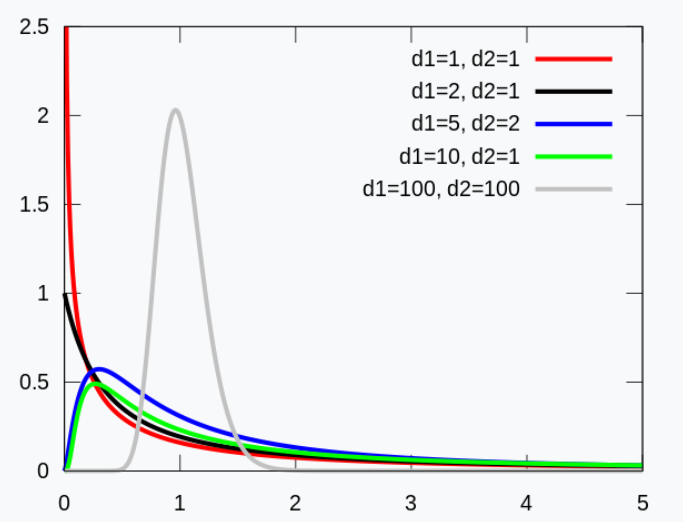
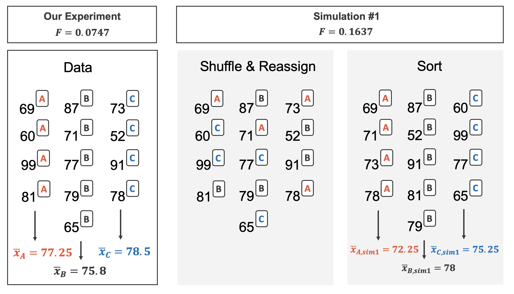

  


  
```{r packages, echo=FALSE, message=FALSE, warning=FALSE}
library(tidyverse)
library(unvotes)
library(knitr)
library(broom)
library(patchwork)
library(ggpubr)
library(scales) # label_dollar 
library(quantreg) # rq
library(kableExtra)
library(openintro)
library(infer)
library(gghighlight)
library(janitor)

hook_output <- knit_hooks$get("output")
knit_hooks$set(output = function(x, options) {
  lines <- options$output.lines
  if (is.null(lines)) {
    return(hook_output(x, options))  # pass to default hook
  }
  x <- unlist(strsplit(x, "\n"))
  more <- "..."
  if (length(lines)==1) {        # first n lines
    if (length(x) > lines) {
      # truncate the output, but add ....
      x <- c(head(x, lines), more)
    }
  } else {
    x <- c(more, x[lines], more)
  }
  # paste these lines together
  x <- paste(c(x, ""), collapse = "\n")
  hook_output(x, options)
})

knitr::opts_chunk$set(comment = NA) # makes it so the ## doesnt appear in output for chunks

source("../_common.R")

library(xaringanthemer)
# style_mono_light(base_color = "#23395b")
style_mono_accent(base_color = "#23395b")
```
.pull-left[
* We saw last class how to compare population means of two different populations 
* Suppose we want to compare means across many populations (SAT scores by city, e.g.)
* We could imagine doing all pairwise comparisons: LA vs SF, SF vs San Jose, Davis vs San Jose, ... 
* However, as we do more and more comparisons, likely that we will see differences in data that are solely due to random chance
* This is the goal of the **analysis of variance** (ANOVA) technique which we will talk about today
]

.pull-right[
* ANOVA uses a *single* hypothesis test to check whether means across many groups are equal.  If $k$ groups,

-   $H_0:$ The mean outcome is the same across all groups: $\mu_1 = \mu_2 = \cdots = \mu_k$ where $\mu_j$ represents the mean of the outcome for observations in category $j.$
-   $H_A:$ At least one mean is different.

Must check three conditions on the data before performing ANOVA:

-   the observations are independent within and between groups,
-   the responses within each group are nearly normal, and
-   the variability across the groups is about equal.
]

---

.pull-left[
### Example
* College departments commonly run multiple sections of the same introductory course each semester because of high demand.
* Consider a statistics department that runs three sections of an introductory statistics course.
* We might like to determine whether there are substantial differences in first exam scores in these three classes (Section A, Section B, and Section C).
* Describe appropriate hypotheses to determine whether there are any differences between the three classes.

]

--
.pull-right[
The hypotheses may be written in the following form:

-   $H_0:$ The average score is identical in all sections, $\mu_A = \mu_B = \mu_C$. Assuming each class is equally difficult, the observed difference in the exam scores is due to chance.
-   $H_A:$ The average score varies by class. We would reject the null hypothesis in favor of the alternative hypothesis if there were larger differences among the class averages than what we might expect from chance alone.
]

---

.pull-left[
* Strong evidence favoring the alternative hypothesis in ANOVA typically comes from unusualyl large differences in the group means
* Key to assessing this is looking at how much the means differ relative to the variability of individual observations within each group

]


.pull-right[
* Look at data below; does it look like the differences in group means could come from random chance? Compare I vs II vs III, then compare IV vs V vs VI
* For groups I/II/III, random chance seems plausible
* For groups IV/V/VI, difference in group centers seem very large relative to variability within each group - possibly due to true differences across groups
]


```{r}
#| label: fig-toyANOVA
#| echo: false
toy_anova %>%
  mutate(group2 = if_else(group %in% c("I", "II", "III"), "A", "B")) %>%
  ggplot(aes(x = group, y = outcome, color = group2, shape = group2)) +
  geom_point(alpha = 0.7, size = 2, show.legend = FALSE) +
  scale_color_openintro() +
  facet_wrap(~group2, nrow = 1, scales = "free_x") +
  labs(x = "Group", y = "Outcome") +
  theme(strip.text = element_blank())
```

---

.pull-left[
#### F distribution
* We saw previously that for comparing two means, or looking at one mean, we had $t$ distribution/statistic as relevant
* For comparing many means, we will use $F$ distribution/statistic
* **Goal**: assess whether or not the variability we see in sample means is so large that it is unlikely to be due to random chance
* To do this, we compute the **sum of squares between groups**.
* For each group, we can calculate a sample mean $\bar x_i$, $i=1, ..., k$ if you have $k$ groups (each group has $n_i$ people)
* We can also calculate the sample mean across *all* observations, $\bar x$

$$\begin{align*}\text{sum of squares btwn groups}&=SSG \newline\\
&= \sum_{j=1}^k n_j (\bar x_j - \bar x)^2\end{align*}$$

]

.pull-right[
* We want to compare this to the total variability of all samples to the total mean across all samples using **sum of squared errors**

$$\begin{align*}SSE&= \sum_{i=1}^n ( x_i - \bar x)^2\end{align*}$$
* The **mean square between groups** is normalized version of SSG, and **mean squared errors** is normalized version of SSE:

$$\begin{align*} MSG &= \frac{1}{\mathsf{df}_G} SSG = \frac{1}{k-1} SSG,\newline MSE&=\frac{1}{\mathsf{df}_E} SSE =\frac{1}{n-k} SSE.\end{align*}$$
* The F-statistic is ratio of these two quantities:
$$F = \frac{MSG}{MSE}$$
* Under null hypothesis that all means are the same, and under conditions, F has $F$ distribution with $df_1=k-1$, $df_2=n-k$. 
]


---

### Test statistic for three or more means is an F

.pull-left[ 
The F statistic is a ratio of how the groups differ (MSG) as compared to how the observations within a group vary (MSE).

$$F = \frac{MSG}{MSE}$$

When the null hypothesis is true and the conditions are met, F has an F-distribution with $df_1 = k-1$ and $df_2 = n-k.$

Conditions:

-   independent observations, both within and across groups\
-   large samples and no extreme outliers
]

.pull-right[
* F distribution is determined by two paramaters, $df_1$ and $df_2$, representing two degrees of freedom
* F distribution in general does NOT look like t distribution or normal distribution - it is always non-negative, so cannot be something which can take negative values
```{r}
#| echo: false
#| out.width: 85%

```

]

.pull-left[
### Example: Batting in MLB
* Let's see whether batting performance of baseball players differs according to position
  - Outfielder (OF)
  - Infielder (OF)
  - Catcher (C)
* Dataset: 429 MLB players frmo 2018, each >= 100 at bats
* We are interested in whether or not the *on-base percentage* (OBP) differs across these 3 groups
* First few rows: 


```{r}
#| label: mlb_players_18-data-prep
#| echo: false
mlb_players_18 <- mlb_players_18 %>%
  filter(
    AB >= 100, 
    !position %in% c("P", "DH")
  ) %>%
  mutate(
    position = case_when(
      position %in% c("LF", "CF", "RF")       ~ "OF",
      position %in% c("1B", "2B", "3B", "SS") ~ "IF",
      TRUE                                    ~ position
    ),
    position = fct_relevel(position, "OF", "IF", "C")
  )
mlb_players_18 %>%
  arrange(name) %>% 
  select(name, team, position, AB, H, HR, RBI, AVG, OBP) %>%
  slice_head(n = 4) %>%
  kbl(linesep = "", booktabs = TRUE, align = "lllrrrrrr") %>%
  kable_styling(bootstrap_options = c("striped", "condensed"), 
                latex_options = c("striped", "hold_position"), full_width = TRUE)
```
]

.pull-right[
* Some variables and descriptions: 

```{r,output.lines=13}
#| label: tbl-mlbBat18Variables
#| echo: false
mlb_players_18_vars <- tribble(
  ~variable,   ~col1,
  "name" ,     "Player name",
  "team" ,     "abbreviated name of the player's team",
  "position" , "player's primary field position (OF, IF, C)" ,
  "AB" ,       "Number of opportunities at bat",
  "AVG" ,      "Batting average, H/AB",
  "OBP" ,      "On-base percentage"
)

mlb_players_18_vars 
```

* Null and alternative hypotheses:
  - $H_0: \mu_{OF} = \mu_{IF} = \mu_C$, the OBP for outfielders, in-fielders, and catchers is the same
  - $H_A: \mu_{OF} \neq \mu_{IF}$, $\mu_{IF} \neq \mu_C$, or $\mu_{OF} \neq \mu_C$ - there is some difference among these three groups 
]

---

.pull-left[
#### Example: class data
* Recall the exams data from last lecture which demonstrated a two-sample randomization test for a comparison of means.
* Suppose now that the teacher had had such an extremely large class that three different exams were given: A, B, and C.
* We provide a summary of the data including exam C in table and boxplot to the right
* Want to investigate whether the difficulty of the exams is the same across the three exams
* Hypothesis test:

  -   $H_0: \mu_A = \mu_B = \mu_C.$ The inherent average difficulty is the same across the three exams.
  -   $H_A:$ not $H_0.$ At least one of the exams is inherently more (or less) difficult than the others.


]

.pull-right[
```{r}
#| label: tbl-summaryStatsForThreeVersionsOfExams
#| echo: false
classdata <- classdata %>%
  mutate(exam = str_to_upper(lecture))

classdata %>% 
  group_by(exam) %>% 
  summarise(
    n    = n(),
    mean = round(mean(m1), 1),
    sd   = round(sd(m1), 1),
    min  = min(m1),
    max  = max(m1)
    ) %>%
  kbl(linesep = "", booktabs = TRUE, 
    col.names = c("Exam", "n", "Mean", "SD", "Min", "Max"),
    align = "lccccc"
  ) %>%
  kable_styling(bootstrap_options = c("striped", "condensed"), 
                latex_options = c("striped", "hold_position"), full_width = FALSE) %>%
  column_spec(1:6, width = "5em")
```

```{r}
#| label: fig-boxplotThreeVersionsOfExams
#| echo: false

classdata %>%
  ggplot(aes(x = exam, y = m1, color = exam)) +
  geom_boxplot(show.legend = FALSE) +
  geom_point(show.legend = FALSE) +
  scale_color_manual(values = c(IMSCOL["red", "full"], IMSCOL["green", "full"], IMSCOL["blue", "full"])) +
  labs(
    x = "Exam",
    y = "Score",
    title = "Boxplot of exam score broken down by version of exam."
    )
```
* Next: randomization test
]


---

.pull-left[
* Idea of the randomization test with many means is the same as in two means

```{r}
#| echo: false
#| out.width: 100%

```

* In each randomization test, we calculate SSG/SSE and use this to calculate F statistics
* Since the groups are randomized, the population means under the randomization are the same, so we can see the types of outcomes that result from pure random sampling
* We plot the outcome of 1,000 randomization trials to the right


]

.pull-right[

```{r}
#| label: fig-rand3exams
#| echo: false 
#| out.width: 90%

set.seed(47)
class_Fstat <- classdata %>% 
  specify(m1 ~ exam) %>%
  calculate(stat = "F") %>%
  pull()

set.seed(47)
classdata %>% 
  specify(m1 ~ exam) %>%
  hypothesize(null = "independence") %>%
  generate(reps = 1000, type = "permute") %>%
  calculate(stat = "F") %>% # get_p_value(obs_stat = class_Fstat, direction = "greater")
  visualize() +
  shade_p_value(obs_stat = class_Fstat, direction = "greater", 
                fill = IMSCOL["red","f3"], color = IMSCOL["red", "full"]) +
  labs(
    y = "Count", 
    title = "1,000 randomized F statistics", 
    x = "F statistic for 1,000 randomizations of the exams."
    )
```
* Our data's observed test statistic had $F = 3.48$
* We see this is quite unlikely - in this randomization test, fewer than 3% of instances where means are equal result in this extreme of a value 
]


---

.pull-left[ 
#### Mathematical model, test for comparing 3+ means
* Under null hypothesis that all means are equal and under conditions of (1) independence, (2) approximately normal (large sample size, no extreme outliers), and (3) nearly the same variance across groups, we know that

$$ F = \frac{MSG}{MSE} \text{ has $F(df=n_1-1, df=n_2-1)$ distribution}$$

* We can thus use a mathematical approach for using $F$ statistic to evaluate null hypothesis 

* The right-tail area for the $F$ statistic gives the $p$-value for the problem 

* Similar functions in R can be used to calculate percentiles and areas for F statistics
  - pnorm, pt, pf - percent of data to the left of a certain value
  - qnorm, qt, qf - value corresponding to data at a certain percentile
]

.pull-right[
* So if we return to the data here
```{r}
#| echo: false
classdata <- classdata %>%
  mutate(exam = str_to_upper(lecture))

classdata %>% 
  group_by(exam) %>% 
  summarise(
    n    = n(),
    mean = round(mean(m1), 1),
    sd   = round(sd(m1), 1),
    min  = min(m1),
    max  = max(m1)
    ) %>%
  kbl(linesep = "", booktabs = TRUE, 
    col.names = c("Exam", "n", "Mean", "SD", "Min", "Max"),
    align = "lccccc"
  ) %>%
  kable_styling(bootstrap_options = c("striped", "condensed"), 
                latex_options = c("striped", "hold_position"), full_width = FALSE) %>%
  column_spec(1:6, width = "5em")
```

* The $F$ statistic for this data was 3.48

* We can use mathematical approach for calculating $p$-value:

```{r}
df2 <- 58+55+51 - 3
pf(3.48, df1 = 2, df2 = df2)
```
* Only 3.3% of data is to the right of 3.48 
* $p$-value of 0.033 < 0.05 - can reject the null hypothesis 

]


---

.pull-left[
#### ANOVA tables from R
* Let's again look at the MLB data (note we are using a modified version of the `mlb_players_18` dataset)
```{r}
#| echo: false
mlb_players_18 %>%
  arrange(name) %>% 
  select(name, team, position, OBP) %>%
  slice_head(n = 4) %>%
  kbl(linesep = "", booktabs = TRUE, align = "lllrrrrrr") %>%
  kable_styling(bootstrap_options = c("striped", "condensed"), 
                latex_options = c("striped", "hold_position"), full_width = TRUE)
```

* `position` has three levels:
```{r}
unique(mlb_players_18$position)
```

]

.pull-right[
* In R, to do analysis of variance, we use `lm()` and `anova()`:
```{r}
(mod <- lm(OBP ~ position, data = mlb_players_18))

anova(mod) %>%
  tidy()
```
* Degrees of freedom $df_1, df_2$ found in column $df$
* F statistic and p value can be found in final two columns
* We need to be sure that all of the conditions needed for F statistic / ANOVA analysis to hold actually do (conditions on next slide)
]

---
.pull-left[
* Conditions for F-statistic/ANOVA analysis
  - Independence: if data comes from simple random sample, this holds.  For MLB we aren't sure, so this might present problems, but let's assume it's OK
  - Approximate normality - when sample size is large and no extreme outliers, then this is ok
  - Approximately constant variance - variance within each group is approximately the same across groups
]
.pull-right[
```{r}
#| echo: false
#| fig-asp: 1.0
#| warning: false
#| message: false
mlb_players_18 %>%
  mutate(
    position = case_when(
      position == "OF" ~ "Outfielders",
      position == "IF" ~ "Infielders",
      position == "C" ~ "Catchers"
    ),
    position = fct_relevel(position, "Outfielders", "Infielders", "Catchers")
  ) %>%
  ggplot(aes(x = OBP)) +
  geom_histogram() +
  facet_wrap(~position, ncol = 1, scales = "free_y") +
  labs(
    x = "On-base percentage",
    y = "Count"
  )
```
* Does appear to be approximately normal, no extreme outliers
* We see that variability across the groups is quite similar
* So our F statistic analysis can proceed

]

---
### Practice 
* IMS 22.9(a, b)
* IMS 22.9c
* IMS 22.12(a,b)
* IMS 22.12c
* IMS 22.13(a,b)
* Take 3 minutes to think about the problem, discuss with your neighbors
* I'll call on one of you and ask what your thoughts are for how to approach the problem
* Not expecting you to have the right answer!  Just want to hear how you approach the problem, then help guide you through thinking about the next steps 